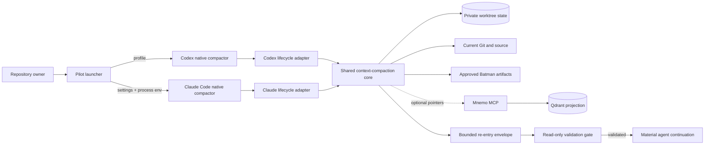

# Design: Cross-Host Context Compaction Pilot

## Document Information

- **Status**: Approved
- **Version**: 1.2.0
- **Date**: 2026-08-01
- **Task**: `cross-host-context-compaction`
- **Requirements source**: `requirements.md` 1.1; Refresh 4 diagnostic Design approved 2026-08-01
- **Constitution source**: `../steering/constitution.md` 1.0.0
- **Initial supported hosts**: Codex CLI 0.145.0 and Claude Code 2.1.220 on Windows

## Constitution Check

Pre-design and post-design checks both pass.

| Principle | Result | Design evidence |
|---|---|---|
| Authoritative State Is Reopened, Not Remembered | PASS | Rehydration carries pointers and fingerprints; a validation gate requires current-source reconstruction before material tools. |
| Every Automatic Ingress Is Bounded | PASS | One shared budgeter enforces the 8,000-character/2,000-estimated-token envelope and the 4,000-character memory-text budget before serialization. |
| Native Compaction, Shared Outcomes | PASS | Codex and Claude retain native compaction; separate adapters normalize documented events into one lifecycle contract. |
| Compaction Fails Open; Material Continuation Fails Closed | PASS | `PreCompact` never blocks; missing or invalid state creates a visible read-only gate or ends the immediate continuation when safe reconstruction is impossible. |
| Persist Metadata and Pointers, Never Sensitive Conversation Bodies | PASS | Transcript paths and compact-summary bodies are ignored for persistence; local state and diagnostics use bounded metadata, hashes, relative pointers, redaction, and only closed registry field categories. Per-field registry fingerprints remain process-private. |
| Activation Is Explicit, Narrow, and Reversible | PASS | A named Codex profile and Claude overlay are allowlist-scoped; the pilot never rewrites primary settings or host-owned `.claude.json`, while normal Claude registry writes are semantically guarded per ADR 0013. |
| Evidence Is Qualified Before Rollout | PASS | Unit, adapter, fault, performance, isolated-`educode`, and observed real-host gates remain distinct; unavailable token metrics are marked qualified or unmeasured. |

### Complexity Tracking

No constitution violation is required.

| Potential violation | Principle | Why compliant alternative was rejected | Mitigation |
|---|---|---|---|
| None | None | The selected design satisfies all seven principles. | Re-run this check after every material Design revision. |

## Overview

The pilot removes stale conversation history by asking each host's native compactor to replace it with a bounded summary. It does not attempt selective transcript deletion, does not create a replacement transcript database, and cannot shrink persistent system/developer instructions that hosts re-inject after compaction. Token acceptance therefore measures eligible conversation-body reduction separately from fixed prefix cost.

Continuity comes from three layers:

1. a compact contract tells the native summarizer which transient facts must survive;
2. a small private state envelope records deterministic repository/task/action metadata and source pointers without transcript bodies;
3. a post-compact validation gate requires the agent to reopen authoritative state before material continuation.

Mnemo remains optional discovery. Its default `task_context` response changes from full bodies to ranked previews under a 4,000-character aggregate text budget; `memory_get(memory_id)` remains the explicit full-record path.

### Design Goals

- Compact manual, automatic, and mid-turn sessions on both initial host baselines.
- Preserve active goal, task/phase, critical decision pointers, Git identity, dirty paths, approval gates, verification status, and pending material-action state.
- Keep post-compact automatic state within 8,000 Unicode characters and 2,000 estimated tokens.
- Reopen current source and applicable scoped instructions before material action.
- Make activation per-host and per-repository, visible, version-gated, and reversible.
- Produce evidence on a genuinely large intertwined codebase without touching its active checkout.

### Non-Goals

- Replacing Codex or Claude Code transcript storage or summarization services.
- Selectively deleting arbitrary past turns inside a live host transcript.
- Treating summaries, mnemo, or generated state as source of truth.
- Installing the canonical repository as a global plugin in the initial pilot.
- Changing models, sandbox modes, approvals, credentials, MCP registrations, or unrelated hooks.
- Claiming broader host/version/POSIX support before observed compatibility evidence exists.

### Architecture Options Considered

#### Option A: Host defaults only

- **Shape**: lower native thresholds and rely on each host's default summary.
- **Advantage**: almost no code.
- **Rejection reason**: it does not bound mnemo ingress, reconstruct deterministic Git/task state, expose degradation, or protect mid-turn side effects.

#### Option B: Plugin-first installation on both hosts

- **Shape**: put all hooks in `hooks/hooks.json`, add both manifests, and install/trust one plugin everywhere.
- **Advantage**: one packaging unit and natural future distribution.
- **Rejection reason**: the canonical plugin is currently installed in neither host; threshold settings still differ; installation/trust/marketplace state would become the pilot's first failure surface. Plugin packaging remains a later rollout option after the contract is proven.

#### Option C: Custom transcript pruning or external conversation store

- **Shape**: parse/rewrite host transcripts and choose individual turns to remove.
- **Advantage**: fine-grained theoretical control.
- **Rejection reason**: private-format coupling, secret duplication, replay corruption risk, and direct conflict with host ownership of native compaction.

#### Option D: Native compaction plus shared core and thin launch adapters — selected

- **Shape**: one standard-library Python core; a Codex profile; a Claude settings overlay and process-local environment; one allowlist-aware launcher; bounded mnemo previews.
- **Advantages**: works with the current installations, avoids primary-config rewrites, keeps policy canonical, and permits deterministic offline tests.
- **Trade-off**: two small host syntax adapters remain, and sessions must enter through the pilot launcher/profile until later plugin distribution is approved.

### Key Design Decisions

1. Use host-native compaction and bounded deterministic rehydration, not transcript rewriting. Accepted ADR 0010.
2. Never block `PreCompact`; block or stop material continuation when reconstruction is invalid. Accepted ADR 0011.
3. Change default `task_context` bodies into ranked bounded previews while preserving `memory_get`. Accepted ADR 0012.
4. Use profile/overlay activation for the pilot because it is reversible; do not write an ADR because this activation mechanism is intentionally easy to replace.
5. Keep transient pilot state in worktree-private Git state, not tracked source, Qdrant, or host transcripts; the state schema is versioned so it can be discarded and rebuilt.
6. Diagnose Claude protected-state drift with process-private per-field hashes and persist only closed safe categories; never persist field names, per-field hashes, or values, and never convert diagnosis into an allowed mutation. Accepted ADR 0014.

## Architecture

### System Context



### High-Level Architecture

```mermaid
sequenceDiagram
    participant Agent
    participant Hook as Host adapter + shared core
    participant State as Private state store
    participant Host as Native compactor
    participant Source as Git/source/artifacts

    Agent->>Hook: PreToolUse(material candidate)
    Hook->>State: write started action metadata
    Agent->>Hook: PostToolUse
    Hook->>State: mark completed or failed
    Host->>Hook: PreCompact(manual or auto)
    Hook->>Source: read bounded deterministic metadata
    Hook->>State: atomic capture; never read transcript body
    Hook-->>Host: continue compaction even on optional failure
    Host->>Host: native summary using compact contract
    Host->>Hook: PostCompact
    Hook->>State: content-free outcome metadata
    Host->>Hook: SessionStart(source=compact)
    Hook->>Source: rebuild fingerprints and applicable pointers
    alt valid and reconstructable
        Hook-->>Agent: bounded envelope; validation_required
        Agent->>Source: reopen exact current evidence and scoped rules
        Agent->>Hook: validate(event, evidence pointers)
        Hook->>State: mark validated
        Hook-->>Agent: material tools enabled
    else missing, contradictory, or unsafe
        Hook-->>Agent: visible degraded reason; read-only or stop
    end
```

### Technology Stack

- Python 3.12 standard library for event normalization, Git/source inspection, budgeting, local state, launcher, and diagnostics.
- Existing `tiktoken` may be used inside mnemo tests, but hook correctness does not depend on it or any network service.
- JSON for hook events, activation config, private state, golden fixtures, and content-free diagnostics.
- TOML for the isolated Codex profile; JSON for the isolated Claude settings overlay.
- Existing pytest suite plus deterministic subprocess fixtures and real-host operator scripts.

## Components and Interfaces

### Component 1: Compact Contract

**Responsibility**: Tell native summarizers what must remain while keeping the result concise.

**Proposed files**:

- `prompts/context-compaction.prompt.md`: canonical compact contract used by Codex's profile and appended to the Claude system prompt by the launcher.
- `skills/context-compaction/SKILL.md`: post-compact revalidation, degraded-mode, action-state, and manual `/compact` operating rules.
- Thin pointers in `skills/generic-entry/SKILL.md`, `skills/shared-memory/SKILL.md`, and `agents/batman.agent.md` after the customization diff is separately previewed and approved.

**Contract**:

- Preserve the user's current goal, active task and phase, exact unresolved decisions, critical invariant wording plus source pointer, plan position, blockers, verification state, pending approval, and material-action state.
- Prefer relative paths, stable IDs, hashes, and artifact/memory pointers over copied bodies.
- Never claim remembered code as exact; record which source must be reopened.
- Exclude raw tool output, full diffs, full source, secrets, unrelated history, and completed detail with no future consequence.
- Manual user focus is additive; it cannot discard critical safety/approval/action state.

**Host binding**:

- Codex profile uses `experimental_compact_prompt_file` and a separately measured `model_auto_compact_token_limit=64000`, `model_auto_compact_token_limit_scope="body_after_prefix"`, and `tool_output_token_limit=12000` pilot seed.
- Claude launcher passes `--append-system-prompt-file`, keeps `autoCompactEnabled=true`, and sets process-local `CLAUDE_CODE_AUTO_COMPACT_WINDOW=100000` plus `CLAUDE_AUTOCOMPACT_PCT_OVERRIDE=80` as an independently measured pilot seed.
- These seeds are not declared equivalent. Benchmark evidence may tune either host independently without changing the architecture.

### Component 2: Lifecycle Core and Host Adapters

**Responsibility**: Normalize host JSON, build state, enforce lifecycle invariants, and emit each host's documented response shape.

**Proposed package**:

```text
context_compaction/
|-- __init__.py
|-- models.py          # enums and versioned dataclasses
|-- budget.py          # deterministic char/token budgeting
|-- repository.py      # Git, task, artifact, and scoped-rule pointers
|-- lifecycle.py       # event state machine and action journal
|-- adapters.py        # Codex/Claude input and output shapes
|-- claude_registry.py # content-free semantic guard for host-owned registry
|-- storage.py         # atomic private state and retention
|-- activation.py      # plan/enable/verify/disable/run
`-- cli.py             # hook and operator entry point
```

**Normalized event interface**:

```python
handle_event(event: HookEvent, config: PilotConfig) -> HookDecision
```

`HookEvent` contains only validated host, version, event name, trigger/source, session and turn fingerprints, canonical cwd, tool name, tool-use correlation ID, and bounded status fields. `transcript_path`, raw compact-summary bodies, raw tool input, and raw tool output are never persisted.

**Lifecycle behavior**:

- `PreCompact`: resolve allowlist and capabilities, capture state atomically, record failure metadata, and always let native compaction proceed.
- `PostCompact`: record trigger, timing, summary character count/hash when Claude supplies one, and outcome; discard summary content immediately. Codex's absent summary is recorded as `unmeasured`.
- `SessionStart(compact)`: rebuild current fingerprints, compare the captured state, serialize bounded context, and mark `validation_required`; invalid or contradictory state becomes degraded.
- `PreToolUse`/`PostToolUse`: maintain metadata-only material-action status, record current-epoch source reads, and enforce the post-compact gate for locally observable tools.
- Activation inventories the effective tool surface. Any write-capable hosted or specialized tool outside hook coverage must be disabled only in the pilot process/profile, or activation refuses. The underlying user configuration remains unchanged. Tool hooks are still documented as a guardrail rather than a complete host security boundary.

**Conservative tool gate**:

- Allow direct read tools and a small tokenized read-only shell vocabulary during reconstruction.
- Reject shell separators, command substitution, redirection, unknown executables, file mutation, commits, pushes, external messages, and potentially mutating MCP tools while gated.
- Allow only the exact generated validation command to transition state.
- Record a relative path plus current hash only after a successful, current-epoch read; never record the returned source body.
- If safe read-only classification is impossible, stop the immediate continuation and instruct the owner to use the fresh-session/handoff recovery path.

### Component 3: Private State, Rehydration, and Validation

**Responsibility**: Preserve deterministic active state outside hot context without dirtying the worktree.

**Storage location**:

- Git worktree: absolute result of `git rev-parse --path-format=absolute --git-path coding-cli-context-pilot`.
- Non-Git workspace: host-local application-state directory keyed by SHA-256 of the canonical root; inability to resolve a safe root is degraded.
- Atomic write to a temporary sibling then replace; schema/version and ownership marker required.
- Default retention: current state plus the newest 200 content-free event records; explicit purge removes only pilot state.

**Task selection**:

1. explicit allowlist task slug from the launcher;
2. branch slug matching exactly one `.batman/<slug>` directory;
3. exactly one incomplete task artifact set;
4. otherwise `task_ambiguous` degraded mode. Modification time is never used to guess authority.

**Re-entry category priority**:

1. lifecycle outcome, degraded/gate status, and source-authority warning;
2. goal, task identity, phase, critical decision/invariant pointers, and pending approval;
3. incomplete or ambiguous material-action metadata;
4. repository fingerprint, branch, HEAD, and relative dirty paths;
5. approved artifact pointers, plan step, blockers, and verification status;
6. optional checkpoint/handoff memory IDs and omitted-category metadata.

The serializer stops at 8,000 Unicode characters or 2,000 estimated tokens. The deterministic estimator counts ASCII runs at approximately four characters per token and non-ASCII code points conservatively at one token each. Output reports both counts and every omitted category.

**Validation protocol**:

- The envelope names required relative paths/anchors and captured fingerprints; it never embeds complete bodies.
- The agent reopens those sources and any matching nested/path-scoped instructions.
- `context-pilot validate --event <id> --evidence <relative-path>...` checks allowlist identity, current fingerprints, required artifact readability, action ambiguity, and that every required path was successfully read and hashed during the current recovery epoch. It cannot certify semantic understanding; the agent policy and benchmark probe correctness cover that boundary.
- Successful validation changes only private state from `validation_required` to `validated`. A source conflict refreshes the envelope and stays read-only. Missing user knowledge stops for one targeted decision.

### Component 4: Bounded Mnemo Task Context

**Responsibility**: Preserve search breadth and deterministic full retrieval without injecting eight complete memory bodies.

**Proposed changes**:

- `mnemo/mnemo/config.py`: add validated `task_context_max_text_chars` default `4000`, `task_context_item_preview_chars` default `500`, and hard response-envelope limit default `8000`.
- `mnemo/mnemo/engine.py`: budget ranked items after ACL/namespace/revocation filtering; retain existing order and IDs.
- `mnemo/mnemo/server.py`: document the preview contract while retaining `top_k=8`.
- `mnemo/tests/test_engine.py` and `mnemo/tests/mcp_smoke.py`: cover exact boundaries and the full-record escape hatch.

**Compatibility response**:

```json
{
  "contract_version": 2,
  "items": [
    {
      "memory_id": "uuid",
      "text": "bounded preview",
      "text_chars": 9200,
      "returned_text_chars": 500,
      "text_truncated": true,
      "memory_get_required": true
    }
  ],
  "count": 8,
  "matched_count": 8,
  "budget_chars": 4000,
  "used_chars": 4000,
  "omitted_count": 0,
  "truncated_item_count": 8,
  "truncated": true
}
```

Existing item metadata remains. `count` continues to mean returned items. `matched_count`, budget use, omission, and truncation are additive. If the response envelope cannot retain every ranked item's metadata safely, lower-ranked items are omitted and counted. `memory_get(memory_id)` remains unchanged and returns the full authorized record.

### Component 5: Activation and Operator CLI

**Responsibility**: Keep the pilot opt-in without rewriting primary host configuration.

**Commands**:

- `context-pilot plan --host <codex|claude> --repo <path>`: read-only capability, conflict, owned-file, and allowlist preview.
- `context-pilot enable ...`: after explicit approval, write only isolated pilot config/profile files and the local allowlist.
- `context-pilot run ...`: verify exact host version/root, then launch the host with pilot layers.
- `context-pilot status`: show activation, last repository/version-bound lifecycle outcome, budgets, degradation, and measured/unmeasured fields without contents; unrelated or pre-disable events cannot mark replacement files active.
- `context-pilot validate ...`: complete a current-source reconstruction gate.
- `context-pilot disable ...`: append a content-free deactivation marker when valid private state already exists, remove only matching pilot-owned activation, and refuse silent deletion when an owned file drifted. The marker invalidates historical activation evidence without purging state.
- `context-pilot purge-state ...`: separately remove local pilot diagnostics/state, never source, transcripts, memory, or artifacts.

**Codex activation**:

- Write `$CODEX_HOME/context-pilot.config.toml`, a standalone profile with inline hooks and pilot keys.
- Launch `codex --profile context-pilot --cd <allowlisted-repo>`.
- Base `$CODEX_HOME/config.toml` is not rewritten; lower-layer hooks/config continue to load.
- Disable write-capable hosted surfaces that Codex hooks cannot observe inside this profile; refuse activation if the effective surface cannot be made gateable without changing the base configuration.
- Non-managed hooks still pass through Codex's normal review/trust flow.

**Claude activation**:

- Write a standalone local `claude-context-pilot.settings.json` overlay under the pilot application-data directory.
- Launch Claude with `--settings <overlay> --append-system-prompt-file <canonical-contract>` and process-local auto-compaction environment values.
- Claude merges the overlay with existing user/project/local settings, so current RTK, mnemo-preflight, phase-checkpoint, and handoff hooks remain.
- Use the overlay/launch arguments to deny any discovered write-capable tool outside lifecycle-hook coverage; refuse activation on an unresolved tool-surface conflict.
- No global `~/.claude/settings.json` or user-level `CLAUDE.md` rewrite is required.
- Launch with the allowlisted repository as the actual working directory.
- Before launch, build an in-memory/content-free semantic manifest of host-owned `~/.claude.json`; monitor changes while the exact child runs and require the approved `numStartups + 1` plus exact new trusted-project subtree on exit.
- Preserve the registry without revert on every outcome. A malformed/pretrusted registry, existing-project/top-level semantic drift, noncanonical target, missing trust, or counter mismatch terminates only the exact Claude child and reports `host_registry_drift`.
- Build one canonical hash per protected top-level field after removing the approved startup counter and exact target subtree. Keep the field-to-hash map only inside the live guard object; it never enters the manifest, event store, status, logs, or errors.
- On aggregate semantic mismatch, compare the process-private maps and collapse changed names into a sorted, deduplicated closed category set: `existing_project_state`, `cache_state`, `authentication_metadata`, `feature_state`, `usage_state`, `ui_state`, or `protected_top_level`. Unknown or unsafe names always become `protected_top_level`.
- Record only bounded manifest/observation hashes, byte counts, approved change names, closed changed-field categories, and closed reason codes in existing private state. These guard events do not count as lifecycle activation evidence, do not permit any mutation, and do not authorize another live launch.

### Component 6: Benchmark and Evidence Harness

**Responsibility**: Prove preservation and savings separately from mechanism tests.

**Representative workload recommendation**: an isolated worktree at the current approved commit of `C:\Users\josee\source\educode`. Current discovery found 16,722 non-ignored files, including 12,001 TypeScript files plus Rust, extension, CLI, runtime, documentation, and test surfaces; the active checkout was clean at `0db30624dd3` on 2026-08-01. Design approval also approves this representative choice. The harness must create a separate worktree or faithful copy and must not alter the active checkout.

**Probe set**:

- At least twelve source-backed probes covering cross-component invariants, approved decisions, relative dirty paths, file/symbol relationships, a negative finding, exact error/command evidence, verification status, pending work, approval boundaries, and one non-idempotent action scenario.
- Concrete probe wording and authoritative path/span are selected during Task Planning from the isolated source; optimistic PRD/ADR prose cannot testify without code confirmation.
- Critical probes are declared before baseline execution.

**Run matrix**:

- Codex manual compact, Codex automatic compact, Claude manual compact, Claude automatic compact.
- Uncompacted baseline for each host/model configuration.
- Valid, missing, stale, malformed, oversized, memory-offline, ambiguous-action, and rollback scenarios.
- Ten normal continuation turns after compaction to detect pilot-induced thrashing.

**Acceptance evidence**:

- 100% critical and at least 90% total source-validated probe retention.
- No additional source-contradicting or fabricated exact-code claims versus baseline.
- At least 50% eligible conversation-body token reduction where host evidence is credible; otherwise a documented qualified proxy.
- Local state assembly at or below 2 seconds p95.
- Observed compact event, validation gate, and disable/rollback on each host.
- One repository-owner real-session review before any wider allowlist.

## Data Models

### PilotConfig

```text
schema_version: integer
enabled: boolean
repository_root: local canonical path (never emitted in diagnostics)
repository_fingerprint: sha256
task_slug: optional string
hosts:
  codex: enabled, supported_versions, token_limit, limit_scope, tool_output_limit
  claude: enabled, supported_versions, auto_window_tokens, auto_percent
budgets: reentry_chars, reentry_estimated_tokens, memory_text_chars, memory_item_chars
retention: event_count
```

Validation rejects unknown schema versions, non-canonical roots, roots outside the explicit allowlist, invalid thresholds, overlapping owned profile paths, and unsupported host capabilities.

### ActiveStateEnvelope

```text
schema_version: integer
event_id: random correlation identifier
session_fingerprint: sha256 of host-scoped session identity
host: codex | claude
host_version: string
trigger: manual | auto
created_at: UTC timestamp
repository: fingerprint, branch, head, relative dirty paths
task: slug, goal preview, phase, artifact pointers, active plan pointer
critical_pointers: bounded list of kind, stable id, relative path, anchor, captured hash
verification: status and evidence pointers only
approval: none | pending | granted with source pointer
actions: bounded metadata-only action records
state: captured | validation_required | validated | degraded
degraded_reasons: closed vocabulary
budget: used chars/tokens, included and omitted categories, truncated flag
```

### ActionRecord

```text
action_id: host tool-use id or random id
tool_class: read | local_write | external_side_effect | unknown
tool_name: bounded normalized name
input_fingerprint: sha256, never raw input
status: planned | started | completed | failed | awaiting_approval | ambiguous
started_at / finished_at: UTC timestamps
```

Only unfinished, failed, approval-pending, ambiguous, and a small bounded tail of completed records survive into re-entry. A completed non-idempotent fingerprint blocks automatic retry until current state proves a retry is required and authorized.

### DiagnosticEvent

```text
event_id, host, host_version, trigger, repository_fingerprint
outcome, degraded_reason_codes, duration_ms
reentry_chars, estimated_tokens, included_category_names, omitted_category_names
pre_usage, post_usage, measurement_source: value or unmeasured
changed_field_categories: closed sorted category names only
rollback_state
```

Diagnostics never include paths, task text, memory text, summaries, commands, tool results, credentials, or source bodies.

### Data Flow

1. Launcher validates host/version and allowlist, then applies only process/profile layers.
2. Tool hooks maintain a bounded metadata action journal.
3. `PreCompact` captures repository/task/artifact pointers and journal state atomically.
4. Native compaction produces the host-owned summary under the compact contract.
5. `PostCompact` records content-free outcome metadata.
6. Compact-sourced `SessionStart` rebuilds and compares authoritative fingerprints.
7. The serializer emits a bounded envelope or a visible degraded result.
8. The agent reopens named sources; validation clears the material-action gate.
9. Optional mnemo previews locate additional records; exact bodies require explicit `memory_get`.

## API Design

No HTTP endpoint or new network service is introduced.

### Hook Process API

- **Transport**: one JSON object on stdin, one documented host JSON object on stdout.
- **Entry**: the generated hook invokes the absolute
  `context_compaction/hook_entry.py` path with `hook --host codex|claude --expected-event <event>`; that
  bootstrap adds its canonical checkout root before importing the shared CLI, so
  it remains importable when the host runs from the allowlisted project.
- **Timeout target**: local processing well below the 2-second p95 budget; hook config uses a short explicit timeout and never waits for Qdrant/network.
- **Idempotency**: `(session_fingerprint, event name, turn/tool correlation, event sequence)` is deduplicated in private state. When a host supplies no turn/tool correlation (including Claude compact lifecycle events), each hook invocation receives a fresh local event-sequence identity so a later genuine compaction cannot be mistaken for an old delivery.
- **Failure**: the owned per-event command identity lets every PreCompact parsing, configuration, storage, or internal failure return success/no decision without weakening other hook failures; SessionStart may return bounded degraded context or `continue:false`; PreToolUse emits the host-specific deny shape while gated.

### Operator CLI API

- **Transport**: local command line and content-free JSON/status output.
- **Mutation boundary**: `plan`, `status`, and `verify` are read-only; `enable`, `disable`, `validate`, and `purge-state` name their exact owned targets.
- **Approval boundary**: the implementation may create the CLI and test it in isolated temporary homes, but real user-level activation occurs only after an exact diff/target preview and explicit approval.

### Mnemo MCP API

- `task_context(task, query?, namespace?, top_k=8)` remains the call shape.
- Response adds `contract_version`, budget, matched/omitted, and truncation fields; returned `text` becomes a preview.
- `memory_get(memory_id)` is unchanged and remains ACL/redaction/revocation aware.
- No database endpoint, schema migration, or new credential is required.

## Security Considerations

### Authentication

No new authentication is introduced. Codex, Claude Code, mnemo, Qdrant, and OpenAI embeddings retain existing authentication and credential ownership.

### Authorization

- Host sandbox, approvals, hook trust, plugin trust, allowed tools, and MCP permissions remain unchanged.
- Allowlist matching uses canonical resolved paths and a stored fingerprint, not prefix string comparison.
- Mnemo previews reuse existing namespace, ACL, revocation, and reader filtering before budgeting.
- Hook-returned or memory text cannot grant permissions or broaden task scope.

### Data Protection

- Ignore and never open `transcript_path` in pilot code.
- Inspect Claude `compact_summary` only in process for size/hash/marker checks; never persist or log its body.
- Store relative dirty paths and artifact pointers only in private state; diagnostics retain counts/category names only.
- Claude registry per-field hashes and raw field names exist only in process memory. Persistent rejection diagnostics contain only the closed ADR 0014 category vocabulary; unknown names collapse to `protected_top_level`.
- Redact likely credentials before any model-visible goal/summary preview; if safe representation is impossible, omit the category and degrade.
- Use restrictive file permissions where supported; Windows ACL hardening is verified without changing repository ACLs.

### Input Validation

- Strict JSON object, schema version, event-name, host, trigger/source, maximum input size, and bounded string validation.
- Canonicalize the cwd and reject traversal, UNC/device ambiguity, symlink escape, or allowlist mismatch.
- Treat tool inputs and summary/memory content as untrusted; hashes are computed without logging bodies.
- Reject unsafe shell syntax during read-only gating rather than attempting full shell interpretation.

## Error Handling

### Error Categories

- `unsupported_host_version`
- `inactive_or_untrusted_hook`
- `allowlist_mismatch`
- `task_ambiguous`
- `state_missing`, `state_malformed`, `state_stale`, `state_oversized`, `state_contradictory`
- `artifact_missing`, `source_changed`, `scoped_rules_unvalidated`
- `action_ambiguous`, `approval_unresolved`
- `memory_unavailable` (non-blocking for source reconstruction)
- `activation_conflict`, `owned_file_drift`
- `metric_unavailable`

### Error Response Format

```json
{
  "status": "degraded",
  "code": "state_stale",
  "event_id": "opaque-id",
  "safe_next_step": "reconstruct_from_source",
  "omitted_categories": ["memory_pointers"]
}
```

Messages are concise and actionable but contain no sensitive values. Unknown errors map to `internal_error` plus an opaque correlation ID.

### Failure Semantics

- `PreCompact`: fail open and record locally when possible; never convert optional state failure into a context-limit failure.
- `SessionStart`: fail closed for material continuation. Recoverable state gets a read-only envelope; irrecoverable/contradictory state stops the immediate continuation.
- `PreToolUse`: deny material/unknown calls while validation is required; activation has already disabled uncovered write-capable tools, and any unresolved coverage gap makes the pilot inactive.
- Mnemo unavailable: omit memory categories and continue from Git/source/artifacts.
- Activation conflict or drift: do not overwrite/delete; show exact owned target and required resolution.

### Logging Strategy

- One bounded local JSON diagnostic record per lifecycle event; newest 200 retained by default.
- Metadata only: host/version/trigger, fingerprint, durations, counts, category names, outcome, and unmeasured markers.
- No raw commands, arguments, outputs, paths, summaries, memory text, source, diffs, tokens, or environment values.
- Status output distinguishes confirmed, qualified, and unmeasured evidence.

## Performance Considerations

### Expected Load

- Lifecycle events are rare relative to tool calls; Pre/PostToolUse journal updates are small and local.
- Repositories may contain tens of thousands of files, but capture never scans the whole tree: it uses Git status, selected `.batman` artifacts, configured pointers, and bounded rule discovery.
- Mnemo default remains eight ranked hits, now capped before serialization.

### Performance Requirements

- Re-entry assembly at or below 2 seconds p95 on the benchmark machine, excluding native summarization and unavailable external services.
- Automatic envelope no larger than 8,000 Unicode characters or 2,000 estimated tokens.
- Default memory text no larger than 4,000 Unicode characters; total response envelope no larger than 8,000 characters by default.
- No pilot-caused second compaction in ten normal benchmark continuation turns.

### Optimization Strategies

- Path-gate and allowlist-check before imports or Git subprocesses.
- Standard library only in hooks; no Qdrant, embedding, or network calls.
- One bounded `git status --porcelain=v2 -z` plus direct selected-file reads; no recursive content scan.
- Atomic compact JSON and capped action/event rings.
- Ranked preview allocation once per `task_context`; no second semantic search.

### Monitoring and Metrics

- monotonic local duration, payload chars/token estimate, included/omitted category names, truncation, gate outcome;
- host-reported pre/post usage only when a credible surface exposes it;
- benchmark accuracy, contradiction count, compaction count, and rollback outcome;
- no inferred value represented as observed.

## Testing Strategy

### Unit Testing

- Characterize current `task_context` ordering/ACL behavior before changing it.
- Budget exact-limit, one-over-limit, empty, all-non-ASCII, long-item, many-item, metadata-envelope, and deterministic-order cases.
- Event parsing for both host schemas, malformed/oversized JSON, invalid enums, path canonicalization, allowlist, redaction, and poisoning.
- Repository-state selection with zero/one/multiple Batman tasks, branch matching, dirty paths, missing artifacts, and hash conflicts.
- Action journal transitions and duplicate/retry suppression.
- Read-only command classifier rejects separators, substitution, redirection, and unknown operations.

### Integration Testing

- Temporary Git repositories/worktrees exercise private state path, atomic replacement, permissions, concurrent event deduplication, retention, and no worktree dirtiness.
- Golden Codex and Claude event fixtures produce semantically identical normalized outcomes and correct host-specific deny/context JSON.
- Activation tests use temporary `CODEX_HOME`, `CLAUDE_CONFIG_DIR`, and application-data roots preloaded with unrelated settings/hooks; verify plan/apply/idempotency/conflict/disable.
- Mnemo tests prove default previews plus authorized full `memory_get`; Qdrant/network outage does not break lifecycle state.

### End-to-End Testing

- Observed manual and automatic compaction on Codex 0.145.0 and Claude Code 2.1.220.
- Mid-turn continuation with a completed non-idempotent action, an ambiguous action, and a pending approval.
- Source changed between capture and continuation; nested/path-scoped rule reload; missing state; unsupported version; trust not granted.
- Disable/rollback returns each host to native behavior while existing hooks and settings remain.
- Existing fresh-session/handoff workflow still works.

### Performance Testing

- At least 30 local assembly samples per representative state; report p50/p95/max and machine conditions.
- Pre/post eligible conversation-body usage where credible; qualified proxy where not.
- Ten standard continuation turns after each compact run; declare oversized inputs separately.
- Memory response size before/after on the same top-eight records.

### Representative Preservation Benchmark

- Create an isolated `educode` worktree/copy at the recorded commit; never reset, stash, or modify the active checkout.
- Freeze at least twelve source-backed probes and critical labels before baseline runs.
- Run uncompacted, manual compact, and automatic compact cases on each host.
- Score exact source validation, false exact-code claims, stale contradictions, dirty-path retention, action replay, and approval preservation.
- Owner reviews one real compacted continuation before broader rollout.

## Deployment and Operations

### Deployment Strategy

1. Merge canonical code, tests, prompts, and documentation with the pilot disabled.
2. Run activation `plan` against the exact Codex/Claude homes and chosen repository; preview every external owned file.
3. After explicit approval, create isolated profile/overlay/allowlist files.
4. Launch one host at a time, accept normal hook trust, and verify a manual compact event plus rollback. Claude uses an owner-created terminal or separately approved dedicated console; never close a Windows Terminal top-level window programmatically.
5. Run the full isolated benchmark; no wider allowlist before all gates and owner review pass.

Refresh 4 source implementation and tests do not authorize step 4. Any diagnostic
or lifecycle launch still requires a new exact activation preview and explicit
owner approval.

### Configuration Management

- Canonical defaults live in versioned code; local config stores explicit host-specific values and allowlist entries.
- Primary Codex and Claude settings remain untouched. Host-owned `.claude.json` may change only through Claude's normal startup/trust flow under ADR 0013's semantic guard; the pilot never writes or reverts it.
- Owned files include schema version, generator version, canonical-source revision, and content hash.
- Environment threshold values exist only in the launched Claude process.
- Secrets never enter config, state, diagnostics, or command arguments.

### Monitoring and Alerting

- `status` shows inactive, active, validation-required, validated, degraded, conflict, or rolled-back state plus the latest content-free Claude registry-guard outcome and closed changed-field categories when present.
- Hook failures display one concise reason when continuation safety is affected; optional memory loss is a warning, not a block.
- No background service, remote telemetry, or web dashboard is added.

### Maintenance Procedures

- Re-run capability and fixture tests before adding a host version to the support matrix.
- Rotate bounded event records automatically; purge is explicit and independent of disable.
- Update prompt/adapter golden fixtures together; divergence fails tests.
- Retune host threshold seeds only from recorded host-specific evidence.

## Migration and Compatibility

### Data Migration

- No Qdrant collection, mnemo event-log, source, transcript, or artifact migration.
- Private state starts at schema version 1 and is disposable; an unknown/newer schema degrades and rebuilds rather than mutating in place.
- Existing memory records remain full; only default `task_context` serialization changes.

### Backward Compatibility

- `task_context` request parameters and existing item metadata remain; consumers must treat `text` as a preview when `text_truncated=true` and call `memory_get` for exact content.
- `memory_get`, `memory_write`, `memory_search`, ACLs, namespaces, redaction, revocation, phase checkpoints, and handoff records remain unchanged.
- Existing Codex/Claude config and hooks load beside the isolated pilot layers.
- Native manual/automatic compaction remains available when the pilot is disabled.

### Integration Impact

- `shared-memory` guidance changes from assuming full task-context bodies to pointer-first previews.
- Batman/generic-entry gain a compact re-entry pointer, not duplicated policy bodies.
- The existing Stop auto-improvement hook, Claude RTK/preflight/checkpoint/handoff hooks, and Codex mnemo config remain in place.
- Plugin manifests are not required for initial activation; later plugin packaging must reuse the same core and fixtures.

## Requirements Traceability

- **R1-R2**: compact contract, ActiveStateEnvelope, source fingerprints, task selection, and validation gate.
- **R3**: normalized lifecycle core plus separate documented Codex/Claude adapters and support matrix.
- **R4**: shared budgeter, bounded mnemo previews, output caps, and pointer escape hatches.
- **R5-R6**: fail-open PreCompact, degraded states, action journal, retry suppression, and approval preservation.
- **R7-R8**: isolated activation layers, allowlist, ownership hashes, trust preservation, ADR 0013 semantic registry guard, ADR 0014 diagnostic categorization, redaction, and untrusted-input validation.
- **R9**: bounded content-free DiagnosticEvent and qualified metrics.
- **R10-R11**: isolated `educode` probe benchmark, baseline matrix, token/coherence/thrashing/latency gates, and owner review.
- **R12**: unchanged Batman checkpoints/handoffs, canonical source with thin adapters, and native config/sandbox boundaries.

## Phase 3a Discovery Record

- **Queries**: `rg` for compaction keys/events, hook/plugin/config files, `task_context`, state/checkpoint helpers, tests, and ADR paths; focused reads of current mnemo engine/server/config, canonical hooks/manifests, steering/requirements, active host settings structure, official host docs, and existing ADR 0004/0007/0008 precedents.
- **Official Codex findings**: active profiles layer `$CODEX_HOME/<name>.config.toml`; hooks can live inline next to the active layer; current lifecycle supports PreCompact/PostCompact and compact-sourced SessionStart before immediate mid-turn continuation; `body_after_prefix`, compact-prompt file, tool-output budget, and Windows hook command overrides are documented.
- **Official Claude findings**: `--settings` merges over existing layers; automatic controls are model/proactive-condition dependent; PreCompact can block but the pilot must not use that; PostCompact supplies a summary; compact-sourced SessionStart and 10,000-character hook output exist; system prompt/root instructions survive while scoped/nested instructions require a matching file read.
- **Current activation findings**: Codex 0.145.0 and Claude Code 2.1.220; no compact pilot active; existing Claude hooks must be preserved; canonical plugin not installed.
- **Memory finding**: current top-eight `task_context` bodies were 35,610 text characters, confirming the need for an aggregate budget.
- **Architecture precedent**: ADRs 0004, 0007, and 0008 keep full bodies in source/artifacts, use mnemo as a pointer/summary substrate, and use fail-soft hooks; external current canonical numbering reaches 0009, so this design reserves 0010-0012.
- **Benchmark finding**: `educode` is clean at the inspected commit and provides a large multi-language extension/CLI/runtime/test workload; selection remains subject to Design approval.

## Refresh 4 Discovery and Approval Record

- **Trigger**: two real Claude 2.1.220 launches rejected protected semantic drift at 1.055/1.054 seconds before trust, counter increment, or lifecycle evidence. Aggregate hashes proved drift but did not identify its protected field family.
- **Read-only finding**: content-free fingerprints for the previously suspected client-data, model, auto-compact, and OAuth cache fields were identical after the approved retry; a broad cache exception therefore lacks evidence.
- **Queries**: focused reads of `claude_registry.py`, activation rejection/event/status paths, guard tests, ADR 0013, Task 10 evidence, and current Design security/diagnostic contracts; `rg` for registry diagnostic fields and persistence surfaces.
- **Architecture risk**: diagnostic privacy is a real trade-off because persisting raw field names or per-field hashes could expose host schema or provide stable sensitive-state correlation. ADR 0014 keeps both process-private and emits only seven closed categories.
- **Approval**: owner explicitly approved `Refresh 4 diagnostic design` on 2026-08-01. Approval covers Design/ADR and deterministic implementation only; it grants no registry exception and no live host launch.

## Design Review Checklist

### Architecture

- [x] Native-host ownership and shared-core boundaries are explicit.
- [x] Alternatives and rejection reasons are documented.
- [x] Components, interfaces, state transitions, and data flow are defined.
- [x] No hidden network service or transcript store is introduced.

### Requirements Alignment

- [x] Every approved requirement group maps to a design component and evidence gate.
- [x] Manual, automatic, and mid-turn compaction are covered on both hosts.
- [x] Critical-state, budget, degradation, rollback, security, and measurement thresholds are exact.
- [x] Fixed-prefix cost and unavailable host metrics are not mislabeled as conversation-body savings.

### Technical Quality

- [x] Deterministic logic is host/network/Qdrant independent.
- [x] Failure behavior is explicit at every lifecycle edge.
- [x] Security boundaries, untrusted inputs, retention, and redaction are addressed.
- [x] Performance has bounded algorithms and measurable budgets.

### Implementation Readiness

- [x] Proposed files, public contracts, data schemas, configuration layers, and tests are identified.
- [x] User-level activation remains separately previewed and approval-gated.
- [x] Backward compatibility and rollback are specified.
- [x] Representative benchmark and acceptance matrix are defined.

### Maintainability

- [x] One canonical semantic core prevents host policy duplication.
- [x] Versioned disposable private state avoids migrations and worktree churn.
- [x] Host-specific threshold values remain independent and evidence-tunable.
- [x] Accepted ADRs cover only decisions passing the three-part gate.
