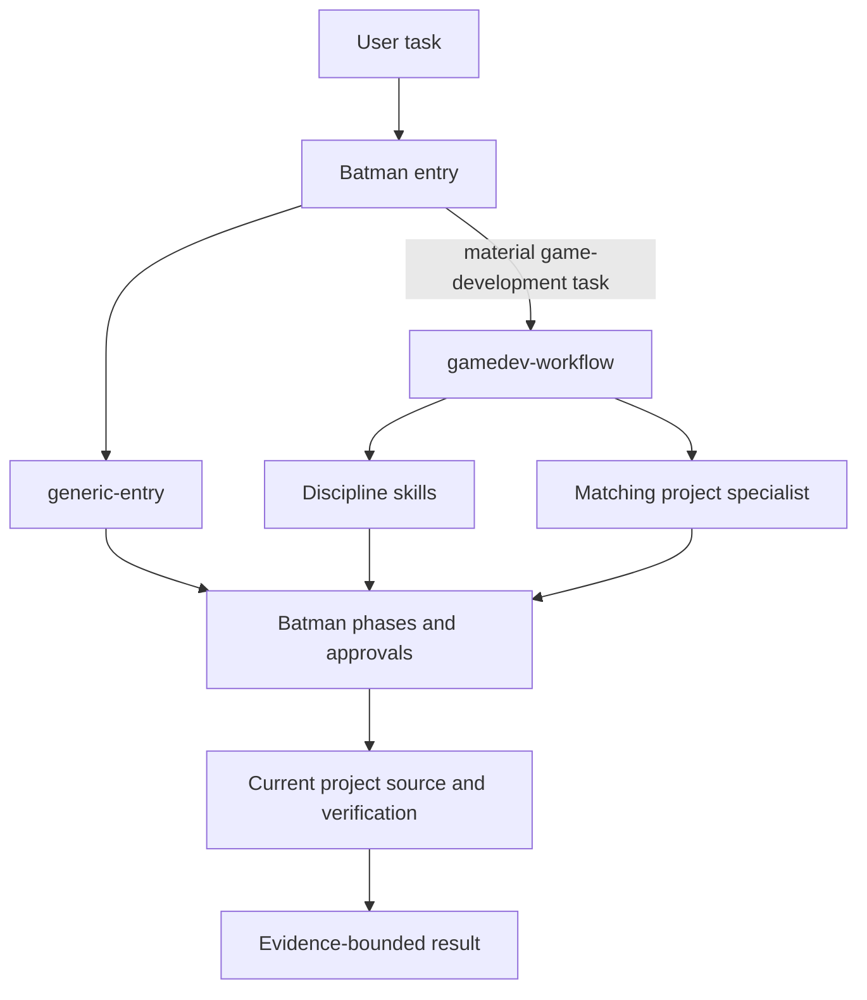
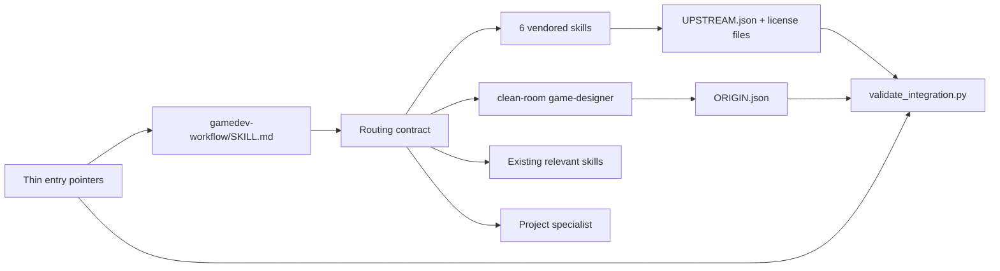
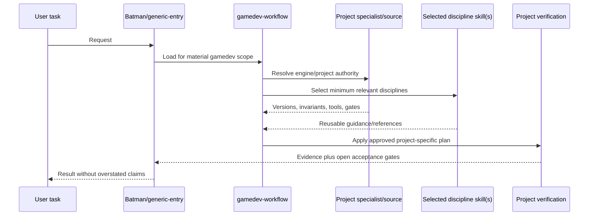

# Technical Design: Gamedev Skills Workflow

## Document Information

- **Feature Name**: Gamedev Skills Workflow
- **Version**: 1.0 approved
- **Date**: 2026-08-01
- **Author**: Codex/Batman
- **Reviewers**: Repository owner
- **Related Documents**: `requirements.md`, all files under `../steering/`, `docs/prd/gamedev-skills-workflow.md`

## Phase 3a Discovery Record

Discovery was read-only and ran after corrected Requirements approval, before this draft.

- Re-read the complete approved `requirements.md` and all current steering files: `understanding.md`, `product.md`, `tech.md`, and `structure.md`.
- Exact `Test-Path` checks confirmed all eight proposed canonical skill destinations remain absent.
- Query `rg -n "gamedev-workflow|game-developer|3d-modeling|game-designer|godot-genre-shooter-fps|godot-particles|godot-performance-optimization|motion-design" AGENTS.md README.md agents prompts skills` returned no canonical router/package hit.
- Re-read `README.md`, `AGENTS.md`, `agents/batman.agent.md`, `prompts/execute-task.prompt.md`, `skills/generic-entry/SKILL.md`, `skills/auto-improvement/SKILL.md`, and `skills/byond-projects/SKILL.md`; the BYOND conditional pointer remains the local routing precedent.
- Re-read `agents/godot-dev.agent.md`; its Godot 4.6/project-tool contract remains evidence that imported Godot 4.7+ defaults cannot be globally authoritative.
- Inspected the system `skill-installer`: it requires `SKILL.md`, rejects an existing destination, performs path-contained extraction, and copies the full selected directory.
- Inspected `quick_validate.py`: current accepted frontmatter keys are `name`, `description`, `license`, `allowed-tools`, and `metadata`; name and description remain required.
- Searched current review/pattern instructions for applicable principles: path containment, fail-fast unknown routes, deterministic prompt fixtures, secrets, responsibility boundaries, and test/implementation alignment.
- Searched for an existing upstream/provenance convention; none exists, so this design defines one task-scoped schema.
- Read the existing PRD/ADR convention. `docs/architecture/adr/0009-gamedev-skill-intake-and-routing.md` is the next available architecture record.
- Revalidated external facts at exact source pins. Six packages are distributable with applicable license preservation; `game-designer` remains excluded and clean-room by user decision.
- Current worktree still reports only untracked `.batman/` and `docs/` at the broad level; no canonical skill/router change exists yet.

Outcome: use one canonical router; six minimally adapted snapshots; one independently authored skill; per-package machine-readable provenance; thin entry pointers; deterministic static verification; no host or game-project mutation.

## Constitution Check

| Principle | Status | Notes |
|---|---|---|
| Canonical Once | Pass | Bodies live under canonical `skills/`; host copies remain untouched. |
| Current Project Authority | Pass | Router defines a strict precedence stack and version/evidence gates. |
| Missing-Only, Path-Contained Mutation | Pass | Destination preflight plus installer fail-closed behavior; no overwrite path. |
| License and Origin Integrity | Pass | Six `UPSTREAM.json` records, applicable license files, and one clean-room `ORIGIN.json`. |
| Deterministic Verification, Honest Acceptance | Pass | Static validator/source/overlap/routing checks; runtime acceptance remains open. |
| Selective Composition | Pass | Router selects primary/secondary skills by task slice; details stay progressive. |
| Reference Assets Never Auto-Execute | Pass | Imported scripts/shaders remain references and no live game is touched. |

**Pre-design check:** 2026-08-01 — pass; no unavoidable violation identified.  
**Post-design check:** 2026-08-01 — pass; every component and verification gate maps to a principle.

### Complexity Tracking

No constitution violations. The third-party manifests and clean-room overlap check add complexity, but they directly satisfy approved licensing/provenance requirements rather than bypassing a principle.

## Architectural Overview

The feature adds a domain router beneath the existing universal Batman entry. `generic-entry` continues to own task classification, memory, approvals, PRD/ADR policy, implementation, review, and documentation. `gamedev-workflow` owns only game-development discipline selection, authority precedence, compatibility gates, and project-specific acceptance boundaries.

Six requested packages are installed from immutable snapshots using the approved installer and then minimally adapted. `game-designer` is created independently through the skill-creation workflow. Each vendored package carries a machine-readable `UPSTREAM.json` plus applicable verbatim license files. The clean-room package carries `ORIGIN.json`. A validator owned by the router checks the integrated contract offline; one-time source and overlap comparisons produce task evidence.

### Design Goals

- One routing authority without duplicating discipline bodies.
- Complete offline-capable packages with reviewable source identity.
- Safe direct and composed use across engines/projects.
- Minimal upstream drift and explicit local adaptations.
- Deterministic static evidence and honest remaining gates.

### Key Design Decisions

1. **Layer `gamedev-workflow` under `generic-entry`**: preserve universal Batman behavior and use the established conditional-domain pattern.
2. **Vendor six; author one**: retain valuable distributable references/assets while excluding restricted `game-designer` prose.
3. **Use per-package JSON provenance**: machine validation and future refreshes need exact pins, hashes, licenses, and adaptations without parsing prose.
4. **Keep upstream bodies minimally changed**: adapt only broken/optional links, supported metadata when required, safety pointers when necessary, and the approved `3d-modeling` repair.
5. **Project specialists win**: generic skills never own project versions, editor bridges, builds, or release acceptance.
6. **Static validator is canonical; source/overlap fetches are task evidence**: normal skill use remains offline, while integration proves external comparisons once at pinned inputs.

## Architecture

### System Context



### High-Level Architecture



### Data Flow



### Technology Stack

| Layer | Technology | Rationale |
|---|---|---|
| Routing | Markdown `SKILL.md` | Native host discovery and progressive disclosure. |
| Source intake | Codex `skill-installer` with pinned refs | Required installer, complete directory copy, existing-destination failure. |
| Local skill creation | Codex `skill-creator` initialization/validation | Required clean-room workflow and valid metadata. |
| Provenance | JSON + verbatim license text | Standard-library parsing, deterministic schema, human review. |
| Validation | Python 3 standard library + `quick_validate.py` | Cross-platform, offline default, actionable failures. |
| Evidence | `.batman/.../evidence/` text/JSON logs | Task-scoped audit output without becoming runtime authority. |

## Components and Interfaces

### Component 1: `skills/gamedev-workflow/`

**Purpose**: Conditional game-development router and integration contract owner.

**Files**:

- `SKILL.md`: trigger boundaries, precedence, routing matrix, compatibility/safety gates, verification boundary.
- `agents/openai.yaml`: display metadata/default prompt generated by the skill-creation workflow when supported.
- `scripts/validate_integration.py`: offline structural validation.
- `references/routing-cases.json`: representative deterministic routing expectations.

**Inputs**: user task, active repository/source, applicable specialist, engine/version/renderer/platform, approved Batman artifacts.  
**Outputs**: selected skill names, specialist authority, compatibility checks, and project-specific acceptance obligations.  
**Dependencies**: `generic-entry`; existing skill resolution order; canonical `skills/` paths.

The router never executes imported examples and never owns game-project facts.

### Component 2: Six Vendored Skill Packages

**Packages**: `game-developer`, `3d-modeling`, `godot-genre-shooter-fps`, `godot-particles`, `godot-performance-optimization`, `motion-design`.

**Package interface**:

```text
<skill>/
├── SKILL.md                 # Upstream body, minimally adapted where recorded
├── ...                      # Complete upstream references/scripts/modules
├── UPSTREAM.json            # Source, hashes, license chain, adaptations
├── LICENSE.upstream         # Verbatim applicable upstream license
└── LICENSE.registry         # Only for 3d-modeling registry-chain notice
```

`LICENSE.registry` is specific to `3d-modeling`: its requested registry is MIT, while its package metadata/original source identify Apache-2.0 content. Both records remain visible.

### Component 3: Clean-Room `skills/game-designer/`

**Purpose**: Independently authored mechanics/design workflow matching the approved capability, without restricted prose.

**Content boundary**:

- Inputs are approved requirements and general game-design knowledge only.
- Covers player promise/audience/constraints, core loops, mechanics/state/invariants, progression/economy/balance, onboarding/accessibility, prototypes/playtests/telemetry, and implementation handoff.
- Uses no copied examples, section wording, or unique structure from the excluded snapshot.
- `ORIGIN.json` records the excluded source pin/hash, metadata decision, user approval, authoring basis, and overlap-check result pointer.

### Component 4: Canonical Entry Pointers

**Modified files**:

- `AGENTS.md`
- `agents/batman.agent.md`
- `prompts/execute-task.prompt.md`

Each receives one concise conditional paragraph: material game-development tasks also load `skills/gamedev-workflow/SKILL.md`; it composes with and does not replace `generic-entry` or project specialists. No routing matrix is duplicated.

### Component 5: README and Architecture Record

- `README.md` gains a concise discovery mention for the router and covered disciplines.
- After design approval, create `docs/architecture/adr/0009-gamedev-skill-intake-and-routing.md` using the existing Context / Options / Decision / Consequences / Rollout pattern.

### Component 6: Validation and Evidence

`validate_integration.py` uses only Python's standard library and exits nonzero after reporting all detected failures. It checks expected directories, `SKILL.md` presence, frontmatter names, required local paths, relative Markdown links, provenance/origin schemas, license files, routing-case references, and thin pointer resolution.

One-time implementation evidence additionally records:

- `quick_validate.py` result for all eight skills;
- pinned upstream tree/hash comparison for six packages;
- clean-room normalized-token comparison against the excluded snapshot;
- before/after destination and worktree state;
- representative routing evaluation;
- `git diff --check` and path-scoped review.

## Data Models

### `UPSTREAM.json` Schema

```json
{
  "schema_version": 1,
  "skill": "3d-modeling",
  "retrieved_at": "2026-08-01",
  "source": {
    "repository": "majiayu000/claude-skill-registry",
    "commit": "ef926663574f5f7a0c19b0429b2540373279ed45",
    "path": "skills/data/3d-modeling"
  },
  "origin_chain": [],
  "licenses": [
    {"spdx": "Apache-2.0", "file": "LICENSE.upstream"}
  ],
  "upstream_files": {
    "SKILL.md": "sha256:<hex>"
  },
  "adaptations": [
    {"file": "SKILL.md", "kind": "repair", "reason": "Replace absent mandatory references with approved self-contained checklist"}
  ],
  "local_only": ["UPSTREAM.json", "LICENSE.upstream"]
}
```

**Validation rules**:

- `schema_version` equals `1`; `skill` matches directory/frontmatter name.
- Repository, 40-hex commit, and path are present.
- Every upstream file has a lowercase SHA-256 value.
- Every local difference is represented exactly once in `adaptations` or `local_only`.
- Every declared license file exists and is non-empty.

### `ORIGIN.json` Schema

```json
{
  "schema_version": 1,
  "skill": "game-designer",
  "authorship": "clean-room-canonical",
  "basis": ["approved requirements", "general game-design knowledge"],
  "excluded_source": {
    "repository": "majiayu000/claude-skill-registry",
    "commit": "ef926663574f5f7a0c19b0429b2540373279ed45",
    "path": "skills/gaming/game-designer",
    "reason": "metadata license NOASSERTION and distribution restricted"
  },
  "decision_date": "2026-08-01",
  "comparison_evidence": ".batman/gamedev-skills-workflow/evidence/game-designer-overlap.json"
}
```

### Routing Case Schema

```json
{
  "id": "godot-fps-version-conflict",
  "task": "Tune a Godot 4.6 FPS controller",
  "primary_skills": ["godot-genre-shooter-fps"],
  "existing_skills": ["safe-refactoring-testing"],
  "specialist": "godot-dev",
  "required_gates": ["engine-version-check", "project-source-wins", "live-editor-verification"]
}
```

## Routing Contract

| Task slice | Primary requested skill | Conditional existing skill/authority | Mandatory gate |
|---|---|---|---|
| Mechanics, loops, economy, progression, onboarding, playtests | `game-designer` | `visual-explainer` for complex flows | Player/audience/constraint evidence; measurable playtest question |
| General gameplay architecture; Unity/Unreal systems | `game-developer` | matching specialist; `safe-refactoring-testing` for refactors | Project architecture/platform wins; upstream performance defaults are hypotheses |
| Mesh, topology, UV, baking, LOD, export | `3d-modeling` | project specialist; `imagegen` only when available and bitmap ideation is useful | Target DCC/engine/import contract and validation checklist |
| Godot FPS controller/weapons | `godot-genre-shooter-fps` | matching Godot specialist; testing guidance | Actual Godot version, project scene/input/physics contracts, live editor/runtime gate |
| Godot particles/VFX | `godot-particles` | matching Godot specialist; `imagegen` only for bitmap texture ideation | Renderer/version/budget/accessibility/visual owner gate |
| Godot profiling/optimization | `godot-performance-optimization` | matching Godot specialist | Authored workload, measured baseline, correct renderer/build, regression evidence |
| UI motion, transitions, micro-interactions, Lottie | `motion-design` | project UI authority; `visual-explainer` for flow | Reduced-motion equivalent, semantic state remains clear, on-screen owner acceptance |
| BYOND-family game work | relevant design skill only when needed | `byond-projects` + BYOND specialist | BYOND-RAG evidence and Dream Maker/project verification remain mandatory |
| Cross-discipline feature | smallest union of applicable rows | one matching project specialist | Resolve conflicts by precedence; do not preload unrelated disciplines |

`imagegen` is optional host capability, not installed or mirrored by this task. Existing canonical skills are loaded only when their own trigger applies.

## Authority Precedence

Highest to lowest:

1. Explicit current user decision and authorized scope.
2. Current project source, approved project Requirements/Design/ADR, and testable invariants.
3. Matching project specialist agent and project tool/build/verification contract.
4. Actual engine/version/renderer/platform plus matching official documentation.
5. Authored workload measurements and owner visual/listening/feel acceptance.
6. `gamedev-workflow` routing/safety contract.
7. Selected discipline skill guidance and examples.

A lower layer cannot silently override a higher one. Conflicts are stated and incompatible examples are not applied.

## Installation and Adaptation Flow

1. Capture exact pre-existing destinations, path resolution, `git status --short`, and hashes of overlapping tracked files.
2. If any named destination exists, mark it skipped and exclude it from all install/create/adaptation steps.
3. Initialize `gamedev-workflow` and clean-room `game-designer` with the skill-creation helper; replace generated placeholders through `apply_patch` and remove unused scaffold resources.
4. Invoke the approved skill-installer for each absent upstream package using exact repository, path, commit, and canonical `skills/` destination.
5. Copy applicable root/original license files verbatim and generate each `UPSTREAM.json` from the fetched snapshot before adaptation.
6. Apply only recorded adaptations:
   - `3d-modeling`: approved in-body production checklist replacing three impossible mandatory reads.
   - Godot packages: rewrite dangling sibling references to pinned external optional URLs and label them optional.
   - Any validator-incompatible frontmatter: minimally normalize and record; otherwise preserve supported fields.
   - Add no duplicated generic precedence body to imported packages; the router remains the owner.
7. Author `game-designer` only from the approved capability list; create `ORIGIN.json`.
8. Add the three thin pointers and README discovery note.
9. Run offline validation, one-time source comparisons, clean-room overlap checks, and routing cases.
10. Review all changed paths against the baseline; do not stage, commit, push, or modify host/game roots.

## Clean-Room Comparison Method

- Create the canonical content before fetching the excluded snapshot for comparison in the implementation pass.
- Normalize Unicode/case/whitespace and remove YAML frontmatter.
- Assert whole-file hashes differ.
- Compute contiguous word-token matches: any run of 12 or more words fails; runs of 8–11 words are reported for manual classification as generic terminology or suspicious overlap.
- Record only hashes, counts, run lengths, and short diagnostic locations in `evidence/game-designer-overlap.json`; do not store the restricted source in the repository.
- Any unexplained suspicious overlap blocks completion and requires rewriting from approved requirements, then re-running comparison.

## API Design

No network API or endpoint is introduced. The public interfaces are skill frontmatter/triggers, file paths, JSON schemas, and validator exit codes.

## Database Schema Changes

None. No persistence or runtime service changes.

## Security Considerations

- Treat all fetched third-party text/code as untrusted input during review.
- Installer extraction/destination containment remains mandatory; preflight resolves exact paths.
- No imported script/shader executes during installation or validation.
- No secrets, tokens, credentials, user data, or absolute project paths enter skill packages/manifests.
- External optional links are pinned when possible and never treated as installed authority.
- Clean-room evidence contains hashes/metrics, not the excluded copyrighted text.
- The validator reads files only and never mutates or follows paths outside canonical/workflow roots.

## Error Handling

| Failure | Behavior | Recovery |
|---|---|---|
| Destination exists | Skip; never overwrite/adapt it | Report exact path; continue with other absent skills only |
| Installer/fetch fails | Stop affected intake and report partial state | Preserve evidence; retry only after root cause is resolved |
| License/source mismatch | Fail closed for that package | Re-open requirements/design if distribution strategy changes |
| Missing link/file | Validation fails with path and referrer | Repair only under approved adaptation categories |
| Unsupported version/project conflict | Do not apply example | Use project source/official matching docs or conceptual guidance only |
| Suspicious clean-room overlap | Block completion | Rewrite the local section and re-run comparison |
| Runtime/visual/performance gate unavailable | Report unverified boundary | Leave project-specific acceptance open |

## Performance and Context Considerations

- Entry pointers are one paragraph each.
- Router body holds only routing/precedence/gates; discipline detail remains in selected skill packages.
- Large references/scripts load only when the selected skill explicitly needs them.
- No runtime daemon, database, watcher, or automatic update check is added.
- Game performance guidance requires project workload evidence; no global FPS target is imposed.

## Testing Strategy

### Static Unit/Contract Checks

- Run `quick_validate.py` for all eight skill directories.
- Run `validate_integration.py` against expected directories, schemas, licenses, links, pointer text, and routing fixtures.
- Parse every JSON document with Python's standard library.
- Assert expected names unique across canonical and checked host roots.

### Integration Checks

- Compare all six vendored trees with their pinned upstream file/hash maps and account for every delta.
- Run the clean-room overlap method against the excluded pinned snapshot.
- Evaluate representative routing fixtures, including the Godot 4.6 vs upstream 4.7+ conflict.
- Simulate a second install plan and prove every existing destination is skipped with zero hash change.

### End-to-End Boundary

- Exercise Batman reading the thin pointer and router for representative prompts without editing a game project.
- Confirm selected discipline/specialist/gates match the fixture.
- No Godot/Unreal/BYOND/Roblox/custom-engine runtime is launched; those gates remain explicitly unperformed.

### Review Checks

- `git diff --check`.
- Path-scoped Git review for only approved paths.
- Secret, unsafe-execution, dangling-link, license, and unexplained-drift scans.
- Verify pre-existing untracked `docs/` files and unrelated changes remain intact.

## Deployment and Operations

- Distribution is the canonical Git checkout through existing host resolution/pointers.
- Normal use is offline after vendoring.
- Snapshot updates are manual: repeat license/tree discovery, update pin/hash/adaptations, rerun all validation, and review a superseding design/ADR only if architecture changes.
- No host restart claim is made; host discovery refresh behavior is outside static repository acceptance.

## Migration and Compatibility

- No existing skill is renamed or replaced.
- Existing BYOND routing remains unchanged and composes through the gamedev router when relevant.
- Existing specialist definitions are not modified.
- Godot packages degrade to conceptual/reference guidance when active version or renderer compatibility is unknown.
- Unsupported optional upstream sibling skills remain external links and are not added.

## Rollout and Rollback

Rollout is path-scoped: create eight absent skill directories, add three thin pointers, update README, and add approved docs/evidence. Verification precedes any optional commit.

Rollback, if explicitly requested, removes only the newly created task-owned skill paths, pointer paragraphs, README entry, and new PRD/ADR/evidence files after resolving exact paths and confirming no later user edits. It never resets/stashes the workspace or removes pre-existing `docs/` content. An accepted ADR is superseded rather than rewritten or deleted.

## Accepted ADR 0009

This design offers an ADR because the intake boundary is hard to reverse after redistribution, surprising without context, and selected from real alternatives.

### Options Considered

1. **Literal copy of all seven requested snapshots** — rejected: `game-designer` metadata is restricted/unknown-license and `3d-modeling` is incomplete.
2. **Rewrite all seven skills locally** — rejected: loses maintained assets/references and creates unnecessary ownership/maintenance.
3. **Six pinned, minimally adapted snapshots + one clean-room skill + one router + per-package manifests** — recommended: preserves usable upstream value, respects package-specific licensing, and makes authority/drift reviewable.
4. **Install bodies independently into each host** — rejected: violates canonical-once and creates drift.

Design approval selected option 3 and created accepted ADR `docs/architecture/adr/0009-gamedev-skill-intake-and-routing.md` after the approval checkpoint.

## Requirements Traceability

| Design area | Requirements | Acceptance |
|---|---|---|
| Missing-only intake | GDS-REQ-001, GDS-REQ-002 | GDS-AC-001, GDS-AC-002 |
| Router and routing matrix | GDS-REQ-003, GDS-REQ-004 | GDS-AC-007, GDS-AC-009 |
| Authority and safe reference use | GDS-REQ-005, GDS-REQ-009 | GDS-AC-008, GDS-AC-012 |
| Package completeness/adaptation | GDS-REQ-006 | GDS-AC-003, GDS-AC-004, GDS-AC-006 |
| License/provenance/clean-room | GDS-REQ-002, GDS-REQ-007 | GDS-AC-005, GDS-AC-006, GDS-AC-013 |
| Thin integration/docs | GDS-REQ-008, GDS-REQ-011 | GDS-AC-009, GDS-AC-010 |
| Validation and worktree safety | GDS-REQ-010 | GDS-AC-011, GDS-AC-012 |

## Design Review Checklist

- [x] Architecture, boundaries, and data flow are explicit.
- [x] All approved functional/non-functional requirements are traced.
- [x] Security, licensing, compatibility, context performance, errors, validation, rollout, and rollback are covered.
- [x] No API/database/runtime service is invented.
- [x] Constitution pre/post checks pass with no silent violation.
- [x] Implementation remains gated by Design and Task Planning approval.
