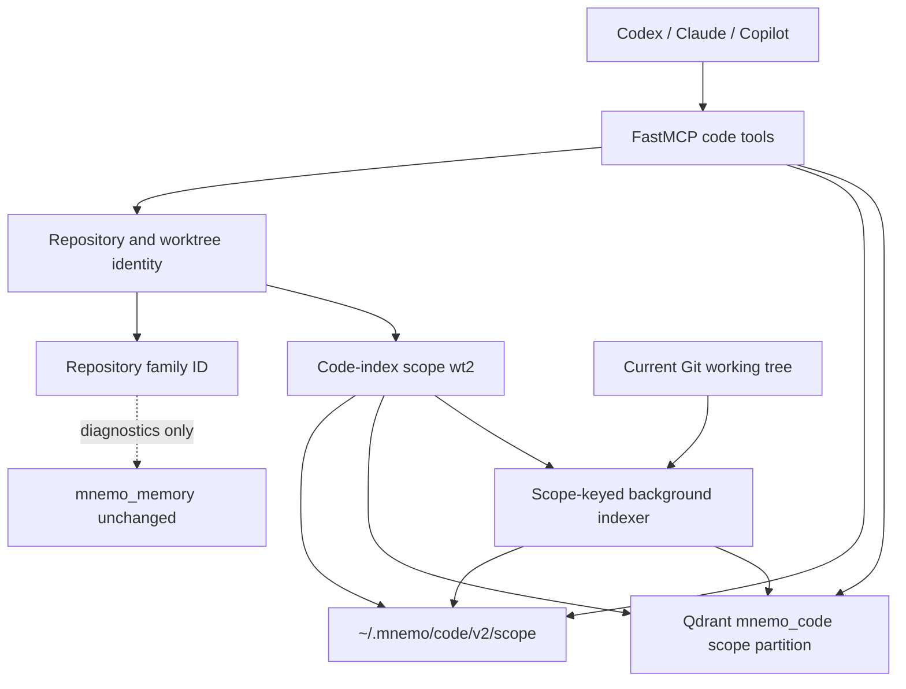
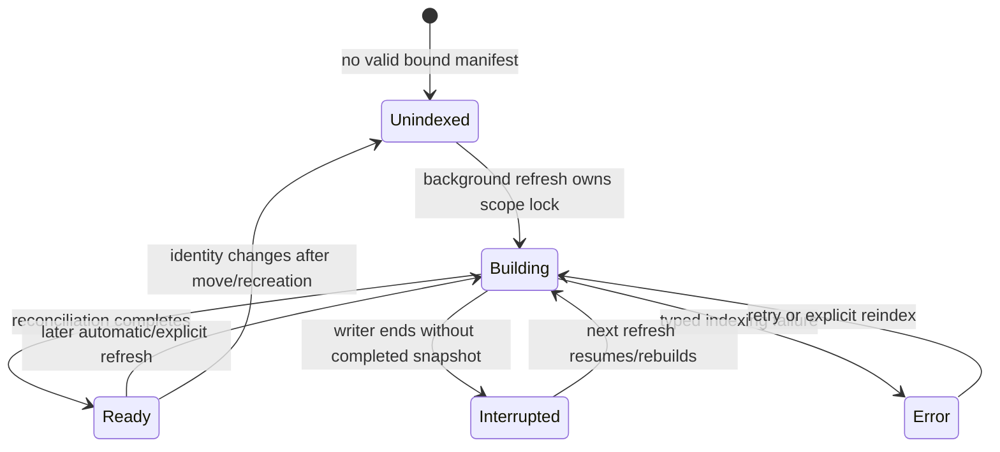

# Technical Design: Mnemo Worktree-Aware Code Index Identity

Status: Approved · 2026-08-06

## Document Information

- **Feature Name**: Mnemo Worktree-Aware Code Index Identity
- **Version**: 1.0
- **Date**: 2026-08-06
- **Author**: Repository owner
- **Reviewers**: Repository owner; mnemo maintainers
- **Related Documents**: [Requirements](./requirements.md), [PRD](../../../docs/prd/mnemo-worktree-index-identity.md), [Proposed ADR 0018](../../../docs/architecture/adr/0018-worktree-scoped-mnemo-code-index-partitions.md)

## Phase 3 Discovery

- **Outcome**: Current source confirms `RepoInfo.repo_id` is the root-history identity and every mutable code-cache boundary consumes it. New Qdrant points can be made invisible to legacy and current history-only queries by using a new `code_index_scope` payload key and omitting the legacy `repo_id` key from v2 points. Local v2 manifests can live below a versioned directory, leaving legacy cache untouched. Existing background indexing creates a fresh `CodeIndex` with a private progress dictionary, so status cannot reliably observe the thread it started; the progress registry must be shared within the MCP process as part of this change.
- **Identity evidence**: `git rev-parse --absolute-git-dir` returns the per-working-tree administrative directory: the main `.git` directory for a primary checkout and the private `.../.git/worktrees/<id>` directory for a linked worktree. Canonical root and Git-directory paths plus filesystem object identity distinguish primary checkouts, linked worktrees, and independent clones. The current Windows/Python 3.12 environment exposes non-zero device/file identifiers and creation time for the Git administrative directory.
- **History evidence**: `compute_repo_id()` and its move-stable root-commit contract were introduced together in commit `e17249c6`. No current code-index ADR records how that repository-family identity should interact with worktrees. Existing ADR 0004 protects durable-memory sharing; the new decision must preserve it.
- **Queries and reads**: `rg` for `RepoInfo`, `compute_repo_id`, `repo_id`, manifests, locks, progress, debounce, Qdrant filters, code tool responses, worktree fixtures, and Git safety; focused reads of `mnemo/mnemo/{code_index,server,config}.py`, `mnemo/tests/{test_code_index,mcp_smoke}.py`, `mnemo/README.md`, current ADRs, Git log/blame, worktree checkpoint hooks/tests, approved Requirements, PRD, and all steering files; read-only Git probes for top-level, absolute Git directory, common directory, HEAD paths, worktree list, and current filesystem identity.
- **Memory preflight**: mnemo was healthy. Approved Phase 1 checkpoint `75342903-1713-484b-bcfa-cdc817c02d3e` and approved Phase 2 checkpoint `c5f29602-274f-40b0-940e-10357b65193c` were treated as summaries; current source and approved artifacts remain authoritative.

### Grill-Me Review

- **Could root history plus a refresh barrier be enough?** No. It cannot isolate lock, debounce, progress, point deletion, or immediate pre-refresh search without making every query synchronous.
- **Could canonical path alone identify a worktree?** No. Normal remove/recreate at the same path would reuse the cache. The selected proof adds per-worktree Git-admin filesystem incarnation evidence and fails closed when it cannot obtain it.
- **Should moves retain embeddings?** No. Because canonical paths are part of the binding, a move rebuilds. Requirements allow this, and it avoids ambiguous cross-filesystem/file-ID rebinding.
- **Should legacy points be migrated or deleted automatically?** Neither. A history-only partition cannot prove its producer. V2 quarantines it and rebuilds; cleanup is optional and explicitly code-cache-only.
- **Could old binaries read new points after rollback?** Not through their family `repo_id` filter. V2 payloads omit that legacy key and use `code_index_scope`; rollback documentation still states that the old design itself is worktree-unsafe.
- **Does isolation solve all freshness?** No. Branch/local edits may still outrun same-tree background refresh. Responses always label the last index snapshot and preserve source verification.
- **Can status observe the thread it starts today?** Not reliably: background `CodeIndex` instances currently own private progress dictionaries. The selected shared process-level registry closes that gap while scope keys preserve independent worktrees.
- **Any scope expansion hidden in the design?** No. Untracked/binary/map eligibility, embeddings/provider, services, ports, credentials, registrations, and durable memory stay unchanged.

## Constitution Check

| Principle | Status | Notes |
|---|---|---|
| Share Memory, Isolate Source Cache | Pass | Only `mnemo_code` identity/cache behavior changes; memory engine, events, namespace, ACL, and retrieval remain untouched. |
| Fail Closed on Identity | Pass | Scope derivation requires a canonical Git root, per-worktree Git directory, and usable filesystem incarnation proof; no history/path-only fallback. |
| Source Authority and Truthful Snapshots | Pass | Responses describe an index snapshot and retain mandatory source verification. |
| Deterministic, Interrupt-Safe Cache Mutation | Pass | Point IDs remain deterministic, manifest writes atomic, and mutation ordering remains resumable. |
| Bounded and Non-Blocking Operation | Pass | Identity is local/bounded; indexing stays in background threads; locks and debounce are scope-keyed. |
| Rebuildable Compatibility | Pass | Tool names/arguments and existing response fields remain; new identity/state fields are additive; legacy cache is quarantined. |
| Real-Git Evidence | Pass | Test design uses actual linked worktrees/clones and deterministic scoped Qdrant collections. |

**Pre-design check:** 2026-08-06 — all seven principles pass.

**Post-design check:** 2026-08-06 — all seven principles pass after component, migration, response, and test review.

### Complexity Tracking

No constitutional violations.

## Overview

Mnemo will keep two explicit identities:

1. **Repository family ID**: the existing root-history-derived `repo_id`, retained for public compatibility and diagnostics. It does not key mutable code-cache state.
2. **Code-index scope**: a versioned digest for one worktree incarnation. It keys all v2 manifests, locks, point IDs/payloads, Qdrant filters, progress, debounce, search, status, reindex, and deletion.

The scope digest is derived from canonical current paths and stable filesystem identity for Git's per-worktree administrative directory and marker. It is deterministic for agents resolving the same physical working tree, distinct across linked worktrees and clones, and changes safely when a working tree is removed/recreated. A move is deliberately treated as a new unindexed scope; rebuild cost is preferable to rebinding a cache across an ambiguous lifecycle boundary.

Legacy history-only manifests and points are quarantined by schema, directory, and payload key. They are never rebound or queried by v2. The active worktree rebuilds incrementally into its own empty v2 scope.

### Design Goals

- Make cross-worktree source/diagnostic contamination structurally impossible through partition keys.
- Preserve repository-family memory and MCP registration compatibility.
- Fail closed for ambiguous identity or manifest binding.
- Keep asynchronous search useful while labeling data as an index snapshot.
- Preserve deterministic recovery and independent concurrent refreshes.

### Non-Goals

- Prove every local edit has already been embedded before search.
- Reuse a legacy history-only partition.
- Persist identity inside source or Git metadata.
- Add a service, watcher, database, provider, credential, or host registration.
- Automatically garbage-collect all old cache scopes in this release.

### Key Design Decisions

1. **Dual identity, never overload family identity**: `repo_id` remains the repository-family compatibility field; `code_index_scope` is the only mutable-cache key.
2. **Versioned worktree-incarnation proof**: scope `wt2_<128-bit digest>` uses canonical root, absolute per-worktree Git/common directories, and filesystem identity for the Git administrative directory plus a stable administrative marker.
3. **Safe move behavior**: canonical paths are part of the proof, so a supported move produces a new unindexed scope and rebuilds.
4. **Legacy quarantine, not migration**: v2 local paths and payload fields cannot match v1 history-only data; no automatic destructive cleanup.
5. **Manifest binding gates queries**: missing, malformed, or mismatched v2 binding is non-queryable even if orphan vectors exist.
6. **Shared in-process progress**: foreground/status and background `CodeIndex` instances share one scope-keyed registry; cross-process lock contention is reported without borrowing another scope's progress.
7. **Snapshot semantics remain asynchronous**: results may lag later edits in the same tree, but always name their worktree scope and last completed snapshot.

## Architecture

### System Context



### Identity and Query Flow

```mermaid
sequenceDiagram
    participant H as Host
    participant S as server.py
    participant R as Identity resolver
    participant B as Background indexer
    participant M as v2 manifest
    participant Q as Qdrant mnemo_code

    H->>S: code_search / status / reindex
    S->>R: resolve candidate per call
    R->>R: canonical root + absolute Git dirs + fs proof
    alt proof unavailable
        R-->>S: WorktreeIdentityUnavailable
        S-->>H: typed content-safe error
    else proof valid
        R-->>S: family ID + code-index scope
        S->>B: kick scope when applicable
        S->>M: load and validate v2 binding
        alt binding missing or invalid
            S-->>H: unindexed/rebuild-required; zero hits
        else binding valid
            S->>Q: filter code_index_scope only
            Q-->>S: scope-local points/count
            S-->>H: identity + snapshot state + source-verification note
        end
    end
```

### Index State Model



### Technology Stack

| Layer | Technology | Rationale |
|---|---|---|
| Identity | Python 3.12, bounded Git CLI, `pathlib`, `os.stat` | Existing platform; no new dependency or network call. |
| Local cache | Versioned JSON manifests + `filelock` | Atomic rebuildable state and OS-released same-scope exclusion. |
| Vector cache | Existing Qdrant `mnemo_code` collection | Additive keyword payload fields isolate scopes without a new service. |
| Embeddings | Existing OpenAI embedder | No product/provider change. |
| Public API | Existing FastMCP stdio tools | Host registrations and tool arguments stay stable. |

## Components and Interfaces

### Component 1: Worktree Identity Resolver

**Purpose**: Produce repository-family and code-index-scope identities from one validated Git working tree.

**Responsibilities**:

- Preserve existing candidate resolution and protected-root/opt-out checks.
- Compute the current repository-family ID with existing root-commit/path-fallback semantics.
- Resolve `--absolute-git-dir` and absolute common directory using bounded `_run_git` calls with `stdin=DEVNULL`.
- Canonicalize root/Git paths using platform case semantics.
- Build a worktree-incarnation proof from Git-directory and stable-marker filesystem identity.
- Reject missing/zero/ambiguous proof instead of using a broader partition.

**Proposed Python contracts**:

```python
class WorktreeIdentityUnavailable(RepoUnresolved):
    pass

@dataclass(frozen=True)
class WorktreeIdentity:
    version: int
    canonical_root: Path
    git_dir: Path
    git_common_dir: Path
    proof_digest: str
    code_index_scope: str

@dataclass(frozen=True)
class RepoInfo:
    root: Path
    repo_id: str                 # existing repository-family compatibility field
    name: str
    worktree: WorktreeIdentity

    @property
    def code_index_scope(self) -> str: ...

    def as_dict(self) -> dict: ...
```

**Proof material**:

- Constant schema label `mnemo-code-worktree-v2`.
- Canonical normalized working-tree root.
- Canonical absolute per-worktree Git directory and common Git directory.
- Git-directory filesystem kind, device ID, non-zero file ID/inode, and birth time when the platform exposes one.
- Stable marker identity: per-worktree `gitdir` file for a linked worktree; common `config` file for a primary checkout. Store kind/device/file ID and birth time, or metadata-change time only on platforms without birth time. For linked marker content, hash the bounded path pointer but never store/log the raw value.
- SHA-256 over canonical length-delimited material; expose `wt2_` plus 32 hex characters. Persist/expose only the proof digest and derived scope, never raw filesystem values.

Changing a stable marker through repair/config maintenance may trigger a conservative rebuild. That is safe and rare. If required identity material is absent or cannot be read, return `worktree_identity_unavailable`.

### Component 2: Versioned Manifest Binding

**Purpose**: Ensure local incremental state belongs to the exact resolved scope before search or mutation.

**Responsibilities**:

- Store v2 state at `~/.mnemo/code/v2/<code_index_scope>/manifest.json` and lock beside it.
- Validate schema, scope, proof digest, repository family, and canonical root before use.
- Refuse queries when a manifest is absent, corrupt, or bound to another identity.
- Flush a new empty binding before the first point can become queryable.
- Preserve atomic `os.replace` writes and under-approximation recovery.

```python
@dataclass(frozen=True)
class ManifestBinding:
    schema_version: int
    identity_version: int
    repository_family_id: str
    code_index_scope: str
    proof_digest: str
    repo_root: str

    def matches(self, repo: RepoInfo) -> bool: ...
```

### Component 3: Scope-Partitioned Vector Operations

**Purpose**: Make all vector reads and writes exclusive to one worktree scope.

**Responsibilities**:

- Add keyword indexes for `code_index_scope` and `repository_family_id`.
- Create deterministic point IDs from `v2:<scope>:<relative-path>:<chunk-index>`.
- Put `code_index_scope` and `repository_family_id` in every v2 payload.
- Omit legacy payload key `repo_id` from v2 points so an older binary cannot accidentally query v2 data by family ID.
- Filter search, count, per-file sweep, full-scope reset, and stale deletion by `code_index_scope` only.
- Never touch `mnemo_memory`.

### Component 4: Scope-Keyed Progress and Background Refresh

**Purpose**: Keep refresh concurrency/status aligned with the same isolation key as storage.

**Responsibilities**:

- Introduce one process-level `ProgressRegistry`, shared by the foreground `CodeIndex` and every background instance.
- Key progress, live threads, completed-run debounce, and locks by `code_index_scope`.
- Preserve same-scope coalescing and cross-scope parallelism.
- Report same-process detailed progress; report scope-lock contention as `building_elsewhere` without importing another scope's fields.
- Keep background clients separate for thread safety.

```python
class ProgressRegistry:
    def get(self, code_index_scope: str) -> IndexProgress: ...
    def set(self, code_index_scope: str, progress: IndexProgress) -> None: ...
```

`IndexProgress` adds `code_index_scope` while retaining repository name/family diagnostics.

### Component 5: MCP Response Mapper

**Purpose**: Keep public tools compatible while making scope and snapshot state explicit.

**Responsibilities**:

- Preserve `code_search`, `code_index_status`, and `code_reindex` names/arguments.
- Preserve existing top-level `repo`, `repo_id`, and `root`; `repo_id` keeps repository-family meaning.
- Add `repository_family_id`, `code_index_scope`, and `identity_version`.
- Add `index_state`, snapshot metadata, and truthful rebuild/building hints.
- Map identity/Git/index errors to typed, content-safe payloads.

## Data Models and Storage Schema

### v2 Manifest

```json
{
  "schema_version": 2,
  "identity_version": 2,
  "repository_family_id": "g0123456789abcdef",
  "code_index_scope": "wt2_0123456789abcdef0123456789abcdef",
  "proof_digest": "sha256-hex",
  "repo_root": "canonical working-tree root",
  "embed_model": "text-embedding-3-small",
  "code_collection": "mnemo_code",
  "indexing": false,
  "snapshot_head": "optional HEAD oid",
  "last_index": 0.0,
  "files": {
    "path/to/file.py": {
      "sha": "file sha256",
      "chunks": 2,
      "indexed_at": 0.0
    }
  }
}
```

### v2 Qdrant Payload

```json
{
  "code_index_scope": "wt2_...",
  "repository_family_id": "g...",
  "repo": "coding-cli",
  "file_path": "mnemo/mnemo/code_index.py",
  "file_hash": "sha256",
  "language": "py",
  "chunk_index": 0,
  "start_line": 1,
  "end_line": 60,
  "text": "existing indexed chunk body",
  "indexed_at": 0.0
}
```

The v2 payload intentionally has no `repo_id`. Legacy points intentionally have no `code_index_scope`. Neither query generation can match the other.

### Local Cache Layout

```text
~/.mnemo/code/
|-- g<legacy-family-id>/                 # v1 quarantine; never queried by v2
|   |-- manifest.json
|   `-- index.lock
`-- v2/
    `-- wt2_<scope-digest>/
        |-- manifest.json
        `-- index.lock
```

### Relationships

- One repository family may have many code-index scopes.
- One worktree incarnation has exactly one code-index scope for its canonical proof.
- One scope has at most one active index writer, one manifest, and many vector points.
- Durable memory has no relationship to `code_index_scope` and keeps its existing namespace rules.

## Public MCP API Design

No HTTP endpoint is added or changed. The existing stdio MCP contracts receive additive fields.

### `code_index_status`

```json
{
  "ok": true,
  "repo": "coding-cli",
  "repo_id": "g...",
  "repository_family_id": "g...",
  "root": "active canonical working-tree root",
  "code_index_scope": "wt2_...",
  "identity_version": 2,
  "index_state": "unindexed|building|building_elsewhere|ready|interrupted|error",
  "collection": "mnemo_code",
  "embed_model": "text-embedding-3-small",
  "files_in_manifest": 0,
  "chunks_indexed": 0,
  "last_index": null,
  "snapshot_head": null,
  "snapshot_semantics": "last_completed_index; current source must be verified",
  "auto_index": true,
  "progress": {"state": "idle", "code_index_scope": "wt2_..."}
}
```

### `code_search`

- Existing inputs and result entries remain unchanged.
- Top level adds the same identity fields plus `index_state`, `last_index`, and `snapshot_semantics`.
- Missing/invalid binding returns `count: 0`, `results: []`, and an unindexed/rebuild hint without querying Qdrant.
- A valid partial/building scope may return only its own points, labeled building/interrupted.
- The existing “Index locates, source decides” note remains mandatory.

### `code_reindex`

- Existing inputs and `started`/`full` fields remain.
- Response adds repository family, code-index scope, identity version, and target state.
- `full=True` resets only the active v2 scope; it never deletes legacy partitions, another worktree's cache, source, Git metadata, or durable memory.

### Error Contract

```json
{
  "error": "worktree_identity_unavailable",
  "detail": "content-safe actionable explanation",
  "repo": "name when safely known",
  "root": "validated root when safely known"
}
```

| Error | Trigger | Behavior |
|---|---|---|
| `repo_unresolved` | Missing/non-Git/protected/opted-out candidate | No cache access. |
| `git_unavailable` | Git spawn/timeout failure | No eviction, fallback, or false non-repository claim. |
| `worktree_identity_unavailable` | Per-worktree Git/fs proof missing or ambiguous | No history/path-only partition; no query. |
| `manifest_unbound` | v2 binding missing, corrupt, or mismatched | Report unindexed/rebuild-required; no vector query. |
| `search_failed` / `status_failed` | Qdrant/embedder/manifest runtime failure | Preserve source/memory; return typed details. |

## Indexing and Mutation Order

For one resolved scope under its OS-released lock:

1. Load and validate the v2 manifest binding.
2. For a new/mismatched binding, embedding-model change, or full rebuild, delete points filtered by the active `code_index_scope` before exposing a new empty bound manifest. A deletion failure aborts the reset rather than stamping it successful.
3. Atomically flush the bound empty/current manifest before file points become queryable.
4. Discover eligible Git files using existing rules.
5. For each changed file: hash/read/chunk/embed, upsert deterministic v2 points, sweep stale same-file points within the same scope, then record the manifest entry.
6. Sweep manifest files absent from discovery within the same scope.
7. Capture completion time and optional HEAD OID, atomically flush, then publish `ready` progress.

Host termination can leave an under-approximating manifest or an incomplete snapshot, never a manifest claiming unwritten vectors. The next same-scope run resumes idempotently.

## Security Considerations

### Input and Repository Validation

- Preserve candidate precedence, protected roots, `.mnemo-noindex`, Git-only behavior, `stdin=DEVNULL`, output capture, and bounded timeouts.
- Resolve paths strictly before cache access; normalize case only where the platform does.
- Do not accept caller-supplied scope IDs; derive them from the resolved worktree.

### Data Protection

- Never write source or Git metadata for identity.
- Hash identity proof material; do not expose raw device/file IDs or linked-worktree pointer content.
- Return existing root paths only; do not add source bodies, memory text, credentials, or unrelated config to diagnostics.
- Keep durable-memory engine, collection, event log, ACL, redaction, revocation, and namespaces untouched.

### Query Isolation

- Every v2 vector operation requires `code_index_scope` equality.
- Repository family is diagnostic only and cannot authorize a cache operation.
- Missing manifest binding prevents query even when Qdrant contains orphan points under a guessed/colliding key.

## Performance and Reliability

### Expected Load

- Several local MCP processes may query/index the same or different scopes.
- Identity performs a small bounded number of local Git/stat operations per resolution.
- Embedding volume remains driven by changed eligible files inside one scope.

### Optimization

- Same-scope manifest hashes preserve incremental skips.
- Worktree moves/recreation intentionally trade one rebuild for safety.
- Different scopes use different lock/thread/debounce keys and may index concurrently.
- Same-scope agents coalesce through the existing file lock and deterministic point IDs.
- No synchronous reindex is added to search; invalid/unindexed scopes return quickly with a rebuild hint.

### Observability

- Logs name repository and opaque scope prefix, not proof inputs or source.
- Status distinguishes unindexed, local building, external lock contention, ready snapshot, interrupted, and error.
- `last_index` is explicitly the last completed index snapshot time, never a current-source attestation.

## Migration and Compatibility

### Upgrade

1. Updated hosts resolve a v2 worktree scope.
2. V2 ignores `~/.mnemo/code/g...` manifests and Qdrant points lacking `code_index_scope`.
3. First access reports unindexed/building and starts a v2 rebuild.
4. Legacy cache remains quarantined for rollback/manual cleanup; no automatic deletion occurs.
5. Durable memory is untouched.

No data transformation or re-embedding reuse is attempted because a legacy family partition cannot prove which worktree produced it.

### Manual Cache Cleanup

Operator documentation will allow deletion of only:

- the configured `mnemo_code` Qdrant collection, and/or
- `~/.mnemo/code/` cache directories after resolving the exact configured data root.

It will explicitly prohibit deleting `mnemo_memory`, `~/.mnemo/events/`, the OpenAI key file, source, or Git metadata. Cleanup is optional and outside automatic upgrade.

### Rollback

- Stop/reload the MCP server before changing versions.
- Clear rebuildable code-index collection/local cache if a clean old-version rebuild is required.
- Never remove memory events or `mnemo_memory`.
- The old binary's history-only model remains inherently unsafe across worktrees; rollback restores that limitation and must be documented as such.
- V2 points omit legacy `repo_id`, so an old binary does not read v2 scope points as a family partition.

### Public Compatibility

- Tool names and input arguments do not change.
- Existing `repo`, `repo_id`, `root`, result entries, counts, timestamps, and notes remain.
- `repo_id` keeps its repository-family meaning.
- `repository_family_id`, `code_index_scope`, `identity_version`, and snapshot state are additive.

## Testing Strategy

### Unit Tests

- Canonical path/subdirectory variants resolve one scope.
- Primary, linked, and clone Git directories produce distinct scopes despite shared history.
- Missing/zero/failed filesystem proof raises `WorktreeIdentityUnavailable`.
- Point UUIDs and local paths depend on scope, not family.
- Manifest binding rejects schema/scope/proof/root mismatches.
- Git calls retain timeout, output capture, and `stdin=DEVNULL`.

### Qdrant Integration Tests with Fake Embeddings

- Build one real repository, two linked worktrees, and two same-history clones whose same relative file contains unique text; index all and assert zero cross-scope hits/counts/deletions.
- A never-indexed related scope reports zero files/chunks/last-index despite populated sibling scopes.
- Deleting/shrinking a file in one scope does not affect another.
- Same scope remains idempotent/incremental after forced refresh and simulated interruption.
- Legacy points/manifests are invisible to v2; full reset touches only the active scope.
- Different scopes run concurrently; same scope coalesces and shares one lock/debounce key.

### Lifecycle Tests

- `git worktree move` yields a new unindexed scope and never queries the former one.
- Remove/recreate at the same path yields a new incarnation/scope and zero pre-index hits.
- Branch/detached-HEAD changes keep scope isolation and expose snapshot lag truthfully.
- Absolute/relative Git administrative paths resolve equivalent safe semantics.

### MCP Stdio Smoke

- Tool discovery includes all eight memory tools plus the three code tools.
- Smoke uses throwaway memory and code collections and disables automatic embedding work unless explicitly exercised.
- `code_index_status` against an explicit repository validates repository-family/scope fields and snapshot wording.
- Memory write/search/get/forget behavior remains unchanged.
- Real OpenAI/Qdrant smoke is reported separately from deterministic acceptance.

### Validation Matrix

| Gate | Command/Surface | Acceptance |
|---|---|---|
| Focused | `py -3.12 -m pytest -q mnemo/tests/test_code_index.py` | Worktree identity/cache tests pass; Qdrant skip reported if unavailable. |
| Full mnemo | `py -3.12 -m pytest -q mnemo/tests` | Memory and code regressions pass. |
| Stdio/live | `py -3.12 mnemo/tests/mcp_smoke.py` | MCP contract passes with real configured dependencies. |
| Static | scoped Ruff + `py -3.12 -m compileall mnemo` | Changed Python clean; pre-existing unrelated findings separated. |
| Diff | `git diff --check` | No whitespace errors. |
| Owner/live | status/search in two real task worktrees after server reload | Zero cross-scope results; unrun gate remains explicit. |

## Requirement Traceability

| Requirement | Design Coverage |
|---|---|
| R1 Deterministic scope | Worktree Identity Resolver and proof contract. |
| R2 Shared memory | Dual identity and explicit no-change memory boundary. |
| R3 Cache isolation | Versioned paths, scope payload/filter/UUID, registry/lock/debounce keys. |
| R4 Truthful search/status | Index state, binding gate, snapshot semantics, additive responses. |
| R5 Legacy transition | V2 quarantine, no rebinding, optional scoped cleanup, rollback. |
| R6 Lifecycle safety | Incarnation proof, safe move rebuild, recreation/branch tests. |
| R7 Git/path safety | Existing validation plus bounded per-worktree Git/fs proof. |
| R8 MCP compatibility | Unchanged tools/args and additive identity/error fields. |
| R9 Performance/recovery | Incremental same-scope reuse, background concurrency, deterministic recovery. |
| R10 Docs/verification | Real-Git matrix, stdio smoke, README/rollback plan. |

## Deployment and Operations

- No host registration, service, port, credential, or environment change.
- Reload running MCP server processes to pick up code changes.
- First query per worktree may report unindexed/building while v2 embeds that scope.
- Operators may keep quarantined legacy cache until space reclamation is desired.
- `mnemo/README.md` becomes the operator source for code tools, settings, snapshot semantics, upgrade, cleanup, verification, and rollback.

## ADR Decision Test

The selected identity/partition contract passes all three repository ADR criteria:

1. **Hard to reverse**: scope IDs, manifests, payloads, point IDs, and rollback behavior become persisted compatibility boundaries.
2. **Surprising without context**: repository family deliberately does not key code cache, moves rebuild, and v2 omits legacy `repo_id` from vector payloads.
3. **Real trade-off**: safe rebuild/quarantine was chosen over path-only reuse, branch/content partitions, repository mutation, or risky legacy rebinding.

Therefore [ADR 0018](../../../docs/architecture/adr/0018-worktree-scoped-mnemo-code-index-partitions.md) is proposed with this Design and becomes accepted only after explicit Design approval.

## Design Review Checklist

### Architecture

- [x] Identity, storage, background, and public boundaries are explicit.
- [x] Components and interfaces are defined.
- [x] Existing dependencies are retained and justified.
- [x] HTTP/database sections are correctly marked not applicable; Qdrant payload changes are specified.

### Requirements Alignment

- [x] All ten requirements map to design components/tests.
- [x] Same-tree lag is separated from cross-scope contamination.
- [x] Legacy, move, recreation, concurrency, failure, and rollback paths are covered.
- [x] Durable memory remains outside the change.

### Technical Quality

- [x] Identity fails closed and uses no network call.
- [x] Query/mutation filters share one scope key.
- [x] Interruption and deterministic point guarantees remain.
- [x] Diagnostics are additive and content-safe.

### Implementation Readiness

- [x] Data models, payloads, paths, state machine, errors, and mutation ordering are defined.
- [x] Test matrix uses real Git worktrees/clones.
- [x] Migration and rollback are operationally explicit.
- [x] No unresolved design decision remains.

## Open Questions

None. Design approval selects the versioned worktree-incarnation scope, safe rebuild on move/recreation, and legacy quarantine contract above.
