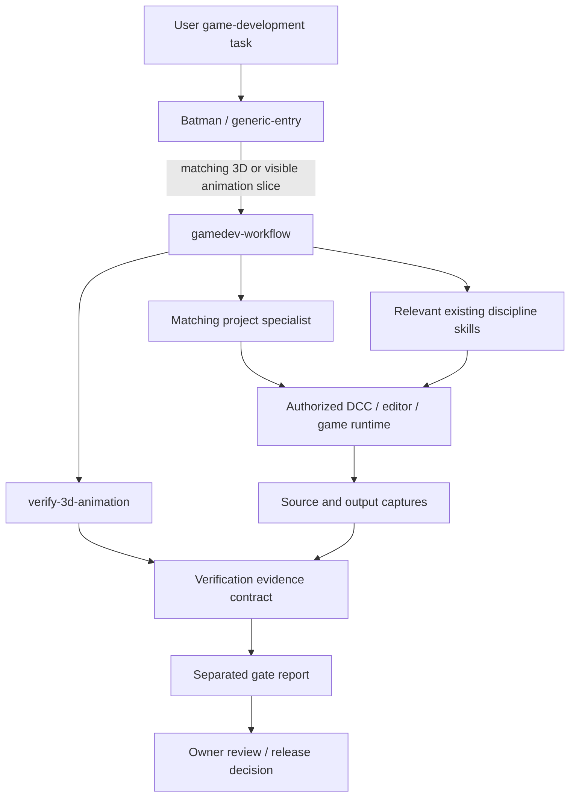
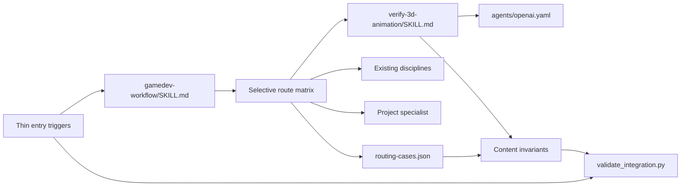
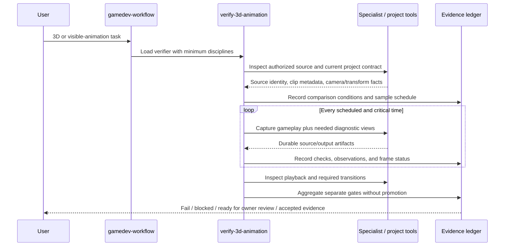

# Technical Design: Verify 3D Models And Animation

Status: Implemented for repository integration · 2026-08-06. Requirements, Design, and Task Plan were approved before the user authorized implementation. Concrete game visual, runtime, owner, and release gates remain outside this repository task.

## Document Information

- **Feature Name**: Verify 3D Models And Animation
- **Version**: 1.0 approved
- **Date**: 2026-08-06
- **Author**: Batman
- **Reviewers**: Repository owner
- **Related Documents**: `requirements.md`, all files under `../steering/`, `docs/prd/verify-3d-animation.md`, and accepted ADR `docs/architecture/adr/0009-gamedev-skill-intake-and-routing.md`

## Phase 3a Discovery Record

Discovery was read-only and ran after Requirements approval, before this draft.

- Re-read the complete approved `requirements.md`, `understanding.md`, `product.md`, `tech.md`, `structure.md`, and the new task constitution.
- Query `rg -n "^### V3A-REQ-|^## |^### " .batman/verify-3d-animation/spec/requirements.md .batman/verify-3d-animation/steering/{product,tech,structure}.md` confirmed fourteen approved requirements and the intended canonical skill/router boundary.
- Query `rg -n "3d|3D|animat|motion|game asset|gamedev-workflow|SKILL_NAMES|VENDORED_NAMES|EXPECTED_ROUTES|routing-cases|host" AGENTS.md agents/batman.agent.md prompts/execute-task.prompt.md README.md skills/gamedev-workflow skills/3d-modeling agents/{godot-dev,unreal-dev,roblox-dev,byond-dev}.agent.md` confirmed three thin entry pointers, one game router, static 3D/import guidance, distinct UI-motion guidance, and materially different project animation/runtime contracts.
- Query `rg -n --hidden -S "skills/gamedev-workflow/SKILL.md|materially concerns game mechanics|gamedev-workflow" . -g '!**/.git/**' -g '!.batman/verify-3d-animation/**'` found no competing entry owner. The canonical router reference appears only in the expected entry, docs, and prior-task evidence paths.
- Read `skills/gamedev-workflow/SKILL.md`, `references/routing-cases.json`, and `scripts/validate_integration.py`. The current validator has eight integrated names, six vendored names, nine expected route shapes, ten fixtures, canonical-host duplicate checks, idempotence hashing, link checks, and one-pointer-per-entry checks.
- Read `skills/3d-modeling/SKILL.md` and `UPSTREAM.json`. Its transform/import checklist is useful but its body is a provenance-recorded upstream adaptation; it does not own source-aligned pose, skeletal deformation, or temporal completion rules.
- Read `skills/game-designer/agents/openai.yaml` and the complete system `skill-creator` instructions plus `references/openai_yaml.md`. `init_skill.py` can create the required `SKILL.md` and `agents/openai.yaml` without unused resources; the UI short description must be 25–64 characters and the default prompt must mention `$verify-3d-animation`.
- Re-read accepted ADR 0009. It already decides one game router below `generic-entry`, canonical-only skill bodies, selective composition, project authority, and separation of static integration from runtime/visual/owner acceptance.
- Checked `git status --short`: only this task's `.batman/verify-3d-animation/` and `docs/prd/verify-3d-animation.md` are untracked. No customization file has changed.
- Shared-memory preflight was healthy and returned the approved Phase 1 and Phase 2 checkpoints. Current files above revalidated those summaries.

Outcome: add one locally authored verifier under the existing router; do not modify vendored bodies, create a second entry path, add a service, or add a host mirror. Extend deterministic routing/content checks and preserve project-specific capture/runtime authority.

## Constitution Check

| Principle | Status | Notes |
|---|---|---|
| Source And Project Authority | Pass | Supplied/project source must be inspected; current user, source, specialists, tool versions, and current rendered feedback remain authoritative. |
| Comparable Evidence Before Judgment | Pass | Reference claims require recorded camera/projection/FOV/aspect/crop/transform/time alignment or explicit uncertainty. |
| Temporal Proof Is Mandatory | Pass | The design defines an endpoint-inclusive formula, critical-frame additions, individual frame results, and transition checks. |
| Pose, Transform, And Deformation Integrity | Pass | Separate transform, skeleton/rest, anatomy/readability, skinning, stressed-joint, and gameplay-view gates are defined. |
| Failed Critical Evidence Fails The Claim | Pass | Missing or failed required evidence cannot be averaged away or promoted to pass. |
| Canonical, Selective Composition | Pass | One new local skill is composed by the existing router; vendored skills and host roots remain unchanged. |
| Deterministic Validation And Honest Acceptance | Pass | Static integration is repeatable and reported separately from live and owner acceptance. |

**Pre-design check:** 2026-08-06 — pass; no unavoidable violation identified.

**Post-design check:** 2026-08-06 — pass; the completed component, interface, error, test, and rollout design introduces no violation.

### Complexity Tracking

No constitution violations. Route and content markers add focused maintenance cost, but they directly enforce approved canonical wiring and fail-closed evidence requirements.

## Architectural Overview

The feature adds `skills/verify-3d-animation/` as the single owner of generic source-fidelity, transform/skeleton, pose/deformation, animation-sampling, evidence-ledger, and completion rules. `gamedev-workflow` remains the only game-domain router and composes the verifier with `3d-modeling`, `motion-design`, VFX/FPS disciplines, `byond-projects`, and the matching specialist only when their task slices apply.

The repository implementation is documentation plus deterministic contract validation. It neither captures game frames nor proves a real asset correct. During later use in an active game, the project specialist chooses authorized DCC/editor/runtime tools, the verifier defines the evidence contract, and the resulting report keeps repository, DCC, import, runtime, reference, per-frame, accessibility, owner, and release states separate.

### Design Goals

- Inspect authoritative source material before claiming a match.
- Compare like with like by recording camera, projection, timing, and transform assumptions.
- Make animation proof multi-frame, deterministic, critical-frame aware, and fail closed.
- Detect pose, occlusion, skeleton, skinning, and deformation failures that a target contact alone can hide.
- Preserve one canonical router and locally owned verifier without modifying vendored skills.
- Make static integration testable while leaving live visual and owner acceptance truthfully open.

### Key Design Decisions

1. **Dedicated local verifier, composed by the existing router**: detailed verification has one owner and applies across 3D, skeletal/procedural, weapon/camera, VFX, and game UI animation.
2. **No vendored-body edits**: `3d-modeling` and `motion-design` retain their recorded upstream/adaptation boundaries; the router composes them with the new skill.
3. **Evidence contract, not an engine adapter**: the skill specifies what must be observed and recorded; specialists own concrete capture commands and exact engine/DCC semantics.
4. **Deterministic base schedule plus risk expansion**: base times are evenly distributed and endpoint-inclusive; contact, extreme, transition, blend, loop-seam, occlusion, deformation, and known-risk times are additive.
5. **Closed gate aggregation**: one missing, blocked, or failed required frame prevents the affected claim from passing.
6. **No new architecture record**: accepted ADR 0009 already governs this predictable local extension; the change is reversible and introduces no new hard-to-reverse service, data, redistribution, or host boundary.

## Architecture Options

| Option | Advantages | Costs / Risks | Decision |
|---|---|---|---|
| A. Add local `verify-3d-animation` and compose it through `gamedev-workflow` | One owner; cross-route reuse; preserves provenance and specialist authority; deterministic routing | Adds one skill and focused validator cases | **Selected** |
| B. Extend vendored `3d-modeling` and `motion-design` bodies | Fewer skill names | Blurs provenance, duplicates rules, still misses weapon/camera/VFX routes | Rejected |
| C. Put the full procedure in `gamedev-workflow` | One file to discover | Bloats the router, mixes selection with discipline procedure, increases context on unrelated game tasks | Rejected |
| D. Add a second universal verifier entry or direct host wiring | Broad automatic reach | Conflicts with ADR 0009, duplicates entry authority, risks host drift and non-game scope expansion | Rejected |

### ADR Decision

No new ADR is warranted. The alternatives are recorded here, while accepted ADR 0009 already settles the architectural trade-off: one conditional gamedev router, canonical-only bodies, selective disciplines, and honest acceptance boundaries. If implementation later requires a service, host registry, duplicated entry owner, or vendored-provenance change, Design must reopen and a superseding ADR must be approved first.

## System Context



## High-Level Architecture



### Technology Stack

| Layer | Technology | Rationale |
|---|---|---|
| Skill procedure | Markdown + YAML frontmatter | Native skill discovery and concise reusable instruction. |
| UI metadata | `agents/openai.yaml` | Host-facing display/default prompt generated through Skill Creator. |
| Routing fixtures | JSON | Existing deterministic, dependency-free contract. |
| Validation | Python 3 standard library | Existing cross-platform integration validator; no new package. |
| Task artifacts | Markdown and project-authorized images/video/frame captures | Durable human-review evidence without a new service. |
| Project execution | Matching specialist and current DCC/engine/editor tools | Exact commands and semantics remain project/version specific. |

## Components And Interfaces

### Component 1: `skills/verify-3d-animation/`

**Purpose**: Own generic verification procedure for game 3D models and visible animation.

**Files**:

- `SKILL.md`: authority, boundaries, source intake, comparable capture, transforms/skeleton, pose/deformation, sampling, per-frame/temporal checks, evidence ledger, and completion rules.
- `agents/openai.yaml`: generated host interface metadata.

No `scripts/`, `references/`, `assets/`, README, changelog, runtime dependency, or provenance manifest is planned. The skill is locally authored and remains below 500 lines.

**Inputs**:

- Authorized task scope and completion claim.
- Supplied/project-authoritative source material, if any.
- Current project source, specialist contract, DCC/engine/renderer/camera/version facts.
- Clip duration/frame rate/range and known critical times.
- Actual gameplay capture plus diagnostic captures when needed.

**Outputs**:

- Deterministic capture schedule.
- Source/output comparison record.
- Transform/skeleton/pose/deformation observations.
- One result per required capture and transition.
- Separated gate report and honest next state.

**Interface metadata**:

```yaml
interface:
  display_name: "Verify 3D Animation"
  short_description: "Verify source fidelity across animation frames"
  default_prompt: "Use $verify-3d-animation to compare this game model or animation with its source and verify every required frame before completion."
```

The skill is initialized during Implementation with system `skill-creator/init_skill.py`, no optional resource directories, then finalized through `apply_patch` and regenerated metadata.

### Component 2: `skills/gamedev-workflow/SKILL.md`

**Purpose**: Select the verifier for relevant slices without duplicating its procedure.

Changes:

- Expand frontmatter/body triggers to name 3D models, transforms, rigs, skeletons, poses, skinning/deformation, retargeting, and visible game animation.
- Add the verifier to 3D-modeling, visible-animation, VFX, and game-UI-motion compositions.
- Add a concise gate summary: source inspection when provided, comparable runtime capture, more than one animation frame, per-frame verification, and separate owner acceptance.
- Preserve authority order, smallest-union selection, BYOND requirements, reduced-motion guidance, renderer/performance gates, and static-vs-live acceptance language.

The router never chooses a camera tolerance, edits a rig, extracts video, or declares a frame passed; those are project execution and verifier procedure concerns.

### Component 3: `references/routing-cases.json`

**Purpose**: Prove representative positive, composed, conditional, and negative routes.

The fixture retains existing cases and adds or updates cases for:

- 3D export/model work composing `3d-modeling` + verifier.
- A source-backed first-person pose with transform, elbow/biceps, grip, and occlusion gates.
- A skeletal loop requiring base schedule, critical frames, loop seam, and per-frame results.
- Godot FPS visible weapon/camera animation composing shooter guidance + verifier.
- VFX and game UI motion composing their disciplines + verifier while retaining renderer/reduced-effects/reduced-motion gates.
- BYOND visible animation composing verifier with `byond-projects` and `byond-dev` authority.
- A non-game animation negative case with no implicit game verifier.
- A non-visual gameplay implementation case that continues to omit the verifier.

### Component 4: `scripts/validate_integration.py`

**Purpose**: Extend current read-only structural validation.

Planned changes:

- Add `verify-3d-animation` to `SKILL_NAMES`.
- Replace the implicit vendored exclusion expression with an explicit local set containing `gamedev-workflow`, `game-designer`, and `verify-3d-animation`; keep only the six existing packages in `VENDORED_NAMES`.
- Update `EXPECTED_ROUTES` for composed 3D/VFX/UI cases and add exact visible-animation/negative routes.
- Treat empty expected skill tuples as assertions (`expected is not None`), enabling the non-game negative case.
- Validate required verifier case IDs and gate subsets, including source inspection, comparable capture, gameplay view, 30-FPS schedule, endpoints, critical frames, per-frame results, loop seam, first-person occlusion, fail-closed aggregation, accessibility, and owner review.
- Add `validate_verifier_content()` to require valid structure, fewer than 500 lines, finalized metadata, and stable semantic markers for the approved formula and completion gates.
- Preserve link containment, idempotence, no-host-mirror, provenance, clean-room, thin-pointer, and BYOND target checks.

The validator checks contract presence, not artistic correctness. Phrase markers are limited to durable approved formulas/vocabulary; stylistic prose remains free to evolve.

### Component 5: Thin Entry Triggers

**Modified files**:

- `AGENTS.md`
- `agents/batman.agent.md`
- `prompts/execute-task.prompt.md`

Each existing gamedev sentence changes `3D production` to the explicit trigger set `3D models/transforms/rigs/poses, visible game animation`. Each still points exactly once to `skills/gamedev-workflow/SKILL.md`; none names the verifier directly or duplicates its rules.

### Component 6: Discovery Documentation

- `README.md` adds source-aligned model/animation verification to the existing `gamedev-workflow` summary.
- The approved PRD and Batman artifacts remain task documentation.
- No new ADR, MCP registry, hook registry, host skill copy, specialist body, or vendored skill body is changed.

## Verification Data Models

These are Markdown record contracts, not runtime TypeScript or persisted application entities.

```typescript
type GateStatus =
  | "pass"
  | "fail"
  | "blocked"
  | "not_applicable"
  | "pending"
  | "ready_for_owner_review";

interface SourceReference {
  idOrPath: string;
  authority: "user" | "project" | "generated-nonauthoritative";
  inspected: boolean;
  viewOrFrame: string;
  sourceFps?: number;
  sourceTimeSeconds?: number;
  ambiguity?: string;
}

interface CaptureConditions {
  viewPurpose: "gameplay" | "diagnostic" | "source";
  cameraPositionAndOrientation: string;
  projection: string;
  fovOrFocalLength: string;
  aspectAndCrop: string;
  resolution: string;
  subjectTransform: string;
  clipTimeOrFrame: string;
  lightingRendererDifferences?: string;
  unresolvedUncertainty?: string;
}

interface SampleSchedule {
  clipStartSeconds: number;
  clipEndSeconds: number;
  normalizedSourceFrameCount: number;
  baseCaptureCount: number;
  scheduledTimesSeconds: number[];
  criticalTimes: Array<{
    timeSeconds: number;
    reason: string;
  }>;
}

interface FrameEvidence {
  id: string;
  clipOrAsset: string;
  sourceFrameOrTime?: string;
  outputFrameOrTime: string;
  normalizedPosition: number;
  captureReasons: string[];
  sourceArtifactPaths: string[];
  gameArtifactPaths: string[];
  observationMethod?: string;
  conditions: CaptureConditions[];
  checks: string[];
  observations: string[];
  status: GateStatus;
}

interface VerificationReport {
  scope: string;
  evidenceLocation: string;
  source: SourceReference[];
  schedule?: SampleSchedule;
  frames: FrameEvidence[];
  gates: {
    repository: GateStatus;
    dcc: GateStatus;
    import: GateStatus;
    runtime: GateStatus;
    reference: GateStatus;
    perFrame: GateStatus;
    temporal: GateStatus;
    accessibility: GateStatus;
    owner: GateStatus;
    release: GateStatus;
  };
  blockers: string[];
  nextAction: string;
}
```

### Validation Rules

- A source-match gate cannot pass unless each authoritative supplied/project reference used for the claim was inspected.
- `CaptureConditions` for a reference comparison must record every listed field or explain why it is unavailable.
- Every unique scheduled or critical time must map to at least one gameplay/output capture and one `FrameEvidence` result with clip/asset, normalized position, every capture reason, source/output artifacts, observations, and status; diagnostic views may add evidence but cannot replace the gameplay view.
- A captured frame cannot pass with an empty check list or unrecorded observations.
- If policy prevents retaining an artifact, `observationMethod` records the authorized inspection method without embedding restricted content.
- Load-bearing frame, time, path, transform, FOV, or camera values must come from current source/tool evidence rather than visual transcription or compressed memory.
- A `fail` in a required/critical frame makes the affected per-frame and clip claim fail.
- A `blocked` or missing required frame prevents pass and identifies the exact missing capability/evidence.
- `repository: pass` never promotes DCC/import/runtime/reference/per-frame/owner/release gates.
- Visible work with all implementation evidence but pending owner acceptance reports `ready_for_owner_review`, not complete.

## Deterministic Sampling Design

Given a positive-duration clip normalized to 30 FPS:

1. Inspect the complete source and output motion at authored speed, repeated/looped when applicable, then scrub or use slow playback to enumerate contacts, extremes, passing positions, transitions, blends, seams, occlusion changes, deformation stresses, and reported risk moments. Sparse samples do not replace this discovery pass.
2. Record `source_frame_count`, the clip's normalized 30-FPS frame count, plus authoritative source FPS/frame/time mapping when it differs.
3. Compute `k = max(2, ceil(source_frame_count / 30))`.
4. Distribute `k` base samples evenly over the closed interval `[clip_start, clip_end]`:

   `t_i = clip_start + i * (clip_end - clip_start) / (k - 1)` for `i = 0..k-1`.

5. Map each time to the exact project/source frame evaluation convention and record rounding; do not silently shift endpoints.
6. Add every identified contact, extreme, passing/acceleration reversal, transition, blend boundary, IK/FK or retarget switch, loop seam, occlusion change, stressed deformation, fast-motion risk, clipping risk, and user-reported/known-risk time not already represented.
7. Verify each unique capture individually. For looped clips, also inspect the last-to-first transition as a pair; two good endpoint stills do not alone prove a clean seam.

If duration or frame metadata is missing or fewer than two distinct animation times can be evaluated, the animation-evidence gate is `blocked`; the verifier must not manufacture duplicate frames to satisfy the count.

## Pose, Transform, And Deformation Checks

### Transform And Skeleton

- Name applicable object/local/world/import/skeleton-rest/bone-pose/root-motion/camera spaces.
- Check units, axes/handedness, origin/pivot, applied transforms, parenting, bind/rest state, bone orientation/roll, root placement, negative/non-uniform scale, retarget assumptions, import settings, and project-specific identity invariants.
- Isolate ambiguous transform layers before altering geometry or animation.

### Pose And Gameplay Readability

- Compare visible landmarks, proportions, position, orientation, balance, silhouette, contacts, and negative space with source material.
- Always inspect the actual gameplay view; add front/side/back or joint-focused diagnostic views as needed.
- For first-person work, check hand chirality, grip/contact, wrist, forearm, elbow, biceps, shoulder chain, weapon/body clipping, screen-edge occlusion, and camera/FOV distortion.
- A hand reaching the target still fails if the elbow/biceps chain disappears, a joint collapses, the bend is implausible, or the intended silhouette/readability is lost.
- After current-user visual feedback, preserve accepted landmarks and dimensions while correcting the rejected pose/transform axis unless the user explicitly broadens scope.

### Skinning And Deformation

- Inspect volume preservation, weight gradients, twist distribution, edge-flow response, normals/tangents, mesh collapse, candy-wrapper artifacts, stretching, clipping, self-intersection, and discontinuity.
- Add stressed frames/views for materially bending shoulders, elbows, wrists, hips, knees, ankles, neck, fingers, and other project-specific risk areas.
- Record topology, weights, skeleton, animation, and import settings as possible layers unless evidence isolates the cause.

## Per-Frame And Temporal Checks

Each required frame checks applicable source pose, landmarks, silhouette, contacts, transform/skeleton integrity, joint readability, deformation, clipping, camera framing, VFX/UI state, and accessibility state. Adjacent captures and playback additionally check timing, spacing, arcs, acceleration, contact stability, foot/hand sliding, popping, interpolation, blend continuity, root-motion continuity, secondary-motion consistency, and loop seam.

Automated overlay/blink/difference/landmark tools may support review only after comparable alignment. Pixel similarity, average error, or a favorable still cannot override a visible anatomical, deformation, contact, timing, or gameplay-readability failure.

## Evidence Flow



## Routing Contract

| Task slice | Selected primary skills | Conditional authority | Required verification boundary |
|---|---|---|---|
| Mesh, topology, UV, baking, LOD, export, or 3D model transforms | `3d-modeling`, `verify-3d-animation` | matching specialist | DCC/import contract plus transform/model/reference evidence where applicable |
| Rig, skeleton, pose, skinning, deformation, or retarget work | `verify-3d-animation` | `3d-modeling` only for mesh/topology work; matching specialist | Skeleton/rest/pose, gameplay/diagnostic views, deformation, source fidelity |
| Skeletal or procedural visible animation | `verify-3d-animation` | matching domain discipline/specialist | Multi-frame schedule, critical frames, per-frame and temporal evidence |
| FPS weapon, hand, recoil, or camera animation | `verify-3d-animation` plus matching FPS discipline | matching specialist | Actual gameplay FOV/camera, first-person joint/readability, clipping, timing |
| VFX/particles animation | VFX discipline + `verify-3d-animation` | renderer/project specialist | Multi-frame evidence plus renderer, budget, reduced-effects, owner visual gate |
| Game UI motion | `motion-design`, `verify-3d-animation` | project UI authority | Multi-frame evidence plus semantic and reduced-motion equivalence |
| BYOND visible animation | `verify-3d-animation` | `byond-projects`, `byond-dev` | Applicable frame evidence plus BYOND-RAG, DMI/DM, and project validation |
| Non-visual gameplay logic | Existing matching discipline only | matching specialist | Verifier not loaded merely because the project is a game |
| Non-game animation | None implicitly | current user may explicitly route through gamedev workflow | No authority expansion |

## Exact Customization Diff Preview

The following is the complete implementation scope proposed for the next approved phases:

| Path | Proposed change |
|---|---|
| `skills/verify-3d-animation/SKILL.md` | New locally authored skill implementing the procedures, formula, closed gate vocabulary, and evidence report above. |
| `skills/verify-3d-animation/agents/openai.yaml` | New generated metadata with the exact three interface strings shown above. |
| `skills/gamedev-workflow/SKILL.md` | Expand triggers; compose verifier for matching 3D/visible-animation/VFX/UI slices; summarize evidence gates without duplicating procedure. |
| `skills/gamedev-workflow/references/routing-cases.json` | Update inherent 3D/VFX/UI animation cases and add source-pose, skeletal-loop, FPS-animation, BYOND-animation, and non-game negative fixtures. |
| `skills/gamedev-workflow/scripts/validate_integration.py` | Add local skill inventory, explicit local/vendored separation, route expectations, content/metadata invariants, and required-case gate checks. |
| `AGENTS.md` | In the existing one-line gamedev pointer only, replace `3D production` with `3D models/transforms/rigs/poses, visible game animation`. |
| `agents/batman.agent.md` | Apply the same thin trigger expansion; retain exactly one router pointer. |
| `prompts/execute-task.prompt.md` | Apply the same thin trigger expansion; retain exactly one router pointer. |
| `README.md` | Expand the existing skill summary to mention source-aligned model/animation verification. |

No other customization path is authorized. In particular: no edits to `skills/3d-modeling/`, `skills/motion-design/`, specialist agent bodies, hooks, `.mcp.json`, user/host skill roots, or active game projects.

## API Design

No network API or HTTP endpoint is introduced. Public interfaces are skill triggers, the Markdown evidence contract, JSON routing fixtures, and validator exit status/output.

## Database Schema Changes

None. There is no runtime service, database, migration, or durable application model.

## Error Handling

| Failure category | Gate result | Required behavior | Recovery |
|---|---|---|---|
| Source missing/inaccessible/corrupt | `blocked` for reference match | Name the source and access failure; do not claim a match | Obtain authorized readable source or mark not provided if authority agrees |
| Conflicting authoritative references | `blocked` | Present conflict; do not choose silently | Obtain current user/project precedence decision |
| Camera/timing/transform not comparable | `blocked` or qualified pending | Record mismatch and uncertainty; avoid pixel-perfect claim | Align conditions or narrow claim |
| Clip metadata invalid or only one distinct time | `blocked` | Do not fabricate duplicate frames | Obtain valid duration/frame mapping or treat as static pose if accurate |
| Required frame missing | `blocked` | Identify exact time/view and prevent clip pass | Capture and verify it |
| Pose/deformation/contact/transition defect | `fail` | Record visible defect and affected layer hypotheses | Correct in project, recapture full affected schedule |
| Specialist/tool/runtime unavailable | `blocked` | Preserve static results separately | Restore authorized project verification surface |
| Owner acceptance pending | `ready_for_owner_review` | State what evidence is ready and what remains open | Obtain explicit acceptance or changes |
| Validator/fixture/content invariant fails | repository `fail` | Print actionable path/case/marker; no completion | Repair approved scope and rerun |

Logging is the task-local evidence ledger and validator stdout/stderr. Do not log source bytes, credentials, private absolute paths beyond authorized durable evidence, or unsupported root-cause claims.

## Security And Privacy Considerations

- Open only user-supplied or project-authorized references and captures.
- Keep proprietary assets in their authorized project locations; do not upload them or write their bytes into this repository, route fixtures, or mnemo.
- Treat media metadata and embedded links as untrusted; use exact resolved paths and project tools.
- Do not broaden filesystem, network, editor, MCP, hook, credential, or sandbox authority.
- Generated images are non-authoritative unless the user explicitly makes them the reference.
- Avoid publishing visual evidence that exposes private levels, characters, filenames, or unreleased content.

## Performance And Context Considerations

- Repository runtime cost remains negligible: one Markdown skill, small JSON fixtures, and standard-library checks.
- Active-project evidence cost is `O(k + c)`, where `k = max(2, ceil(source_frame_count / 30))` and `c` is the count of distinct critical times not already sampled.
- The approved minimum is a floor, not a budget cap. Long, complex, discontinuous, or risk-heavy clips may require more frames.
- The skill body stays below 500 lines; router changes remain summary-only so unrelated game tasks do not load detailed verification unless routed.
- No daemon, video processor, image model, dependency, cache, database, or automatic watcher is added.

## Testing Strategy

### Static Skill Checks

- Run system `quick_validate.py` on `skills/verify-3d-animation/`.
- Assert exact frontmatter name, trigger-rich description, `agents/openai.yaml` presence, 25–64 character short description, and default prompt containing `$verify-3d-animation`.
- Assert the skill stays below 500 lines and has no unresolved placeholders or dangling relative links.

### Integration Contract Checks

- Run `python -m py_compile skills/gamedev-workflow/scripts/validate_integration.py`.
- Parse `routing-cases.json` with Python's standard library.
- Run `python skills/gamedev-workflow/scripts/validate_integration.py --repo-root .`.
- Verify exact positive compositions, the non-visual gameplay omission, and the non-game animation negative case.
- Verify required source, comparison, sampling, per-frame, fail-closed, accessibility, and owner gates are present in named fixtures.
- Verify all nine canonical skills exist, only the six historical upstream packages receive provenance checks, and no same-name host mirror exists.
- Verify all three entry files contain exactly one router pointer and explicit 3D model/rig/pose/visible-animation trigger terms.
- Run the validator twice and confirm its read-only idempotence hashes do not change.

### Content Regression Checks

- Require stable markers for source inspection, comparable capture, named transform spaces, skeleton/rest state, first-person elbow/biceps readability, skinning/deformation, exact sampling formula, endpoints, critical-frame categories, every-frame verification, evidence ledger, fail/blocked states, and `ready for owner review`.
- Confirm `skills/3d-modeling/`, `skills/motion-design/`, specialist bodies, MCP/hook files, and host roots remain byte-unchanged/out of diff.
- Run `git diff --check` and path-scoped diff review.

### Active-Game Acceptance Boundary

This repository task will not launch a DCC, game editor, renderer, or runtime and will not receive a concrete source/game pair. Therefore it can prove only canonical structure, routing, wording invariants, and deterministic validation. A later concrete game task must execute the evidence flow and cannot cite these repository tests as visual, animation, owner, or release acceptance.

## Deployment And Operations

- Distribution remains the canonical Git checkout through current user-level skill resolution.
- No install copy, host registry write, reload claim, environment change, or external deployment is required.
- Normal use selects the skill through the existing gamedev pointer and router.
- Future engine-specific capture helpers require their own approved design and must preserve this evidence contract and project authority.

## Migration And Compatibility

- Existing universal and game routing remain in place; only matching 3D/visible-animation slices gain the verifier.
- Existing project specialists, BYOND documentation mandates, reduced-motion guidance, renderer gates, performance evidence, and owner acceptance remain authoritative.
- Vendored packages and their hashes/provenance are unchanged.
- No existing API, data, command, or skill name is renamed.
- Non-game animation remains out of implicit scope unless explicitly routed by the current user.

## Rollout And Rollback

After Design and Task Plan approval, create the local skill, wire the router/fixtures/validator, expand only the existing thin triggers and README summary, then run focused and full repository validation before review. Do not stage, commit, push, or touch active games unless separately requested.

If rollback is explicitly requested, resolve and remove only the new skill and reverse the exact router/fixture/validator/pointer/README additions after confirming no later edits. Never reset or stash the worktree, delete task history, or rewrite accepted ADR 0009.

## Requirements Traceability

| Requirement | Design coverage | Planned proof |
|---|---|---|
| V3A-REQ-001 — Canonical skill and triggering | Component 1; entry triggers; router | Skill validation, inventory, pointer and route tests |
| V3A-REQ-002 — Selective composition and authority | Router contract; route matrix; architecture | Positive/negative fixtures and unchanged specialist authority |
| V3A-REQ-003 — Source-material intake and provenance | Source model; source/project authority; errors | Required content markers and blocked-source fixture gates |
| V3A-REQ-004 — Comparable source and game captures | Capture model; comparable-evidence principle | Comparable-capture/gameplay-view gates and content markers |
| V3A-REQ-005 — Transform, hierarchy, and skeleton integrity | Transform/skeleton checks | Named-space/rest/root/import markers and source-pose fixture |
| V3A-REQ-006 — Pose, silhouette, anatomy, and gameplay readability | Pose/gameplay section; first-person checks | Elbow/biceps/occlusion markers and first-person fixture |
| V3A-REQ-007 — Skinning and deformation quality | Deformation section; critical stressed frames | Deformation markers and stressed-frame gate |
| V3A-REQ-008 — Deterministic animation sampling | Sampling formula and schedule model | Exact formula/endpoints/critical-time markers and loop fixture |
| V3A-REQ-009 — Per-frame and temporal verification | Per-frame/temporal section; frame model | Per-frame result, transition, loop-seam, fail-closed gates |
| V3A-REQ-010 — Evidence ledger and durable artifacts | Verification report and evidence flow | Ledger-field markers and report vocabulary checks |
| V3A-REQ-011 — Fail-closed completion and owner acceptance | Gate model; aggregation; error table | Failed-frame aggregation and ready-for-owner-review checks |
| V3A-REQ-012 — Workflow and documentation wiring | Router, thin pointers, README, no ADR decision | Pointer counts/triggers, README/router link checks |
| V3A-REQ-013 — Deterministic integration validation | Validator and testing strategy | `py_compile`, quick validation, integration validator twice, diff check |
| V3A-REQ-014 — Privacy, safety, and scope containment | Security, exact diff preview, deployment boundary | Out-of-scope diff review, host-mirror and no-registry checks |

## Design Review Checklist

- [x] Phase 3a discovery was fresh, read-only, source-backed, and recorded.
- [x] Constitution passed before and after drafting with no silent violation.
- [x] Architecture, alternatives, authority, components, data flow, interfaces, and aggregation rules are explicit.
- [x] All fourteen approved requirements are traced.
- [x] Source comparison, transform/skeleton, pose/deformation, sampling, per-frame, temporal, privacy, error, and owner gates are designed.
- [x] API/database sections explicitly record that none are introduced.
- [x] Exact customization paths and exclusions are previewed before mutation.
- [x] Existing ADR 0009 is preserved; no unnecessary new ADR is proposed.
- [x] Static repository acceptance is separated from live visual and owner acceptance.
- [x] Design is approved and the Task Plan is generated; implementation remains blocked until the user asks to start.
